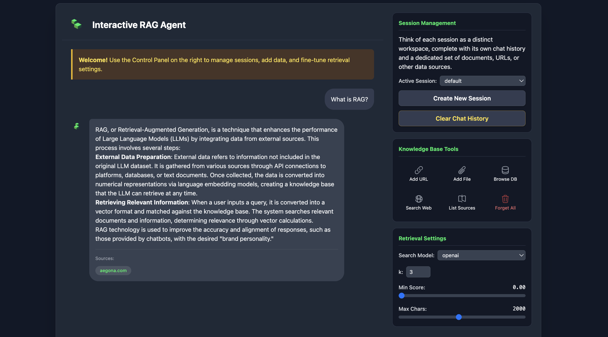
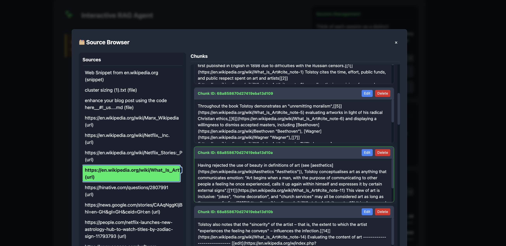

# Interactive RAG Agent



Agents are revolutionizing the way we leverage language models for decision-making and task performance. Agents are systems that use language models to make decisions and perform tasks. They are designed to handle complex scenarios and provide more flexibility compared to traditional approaches. Agents can be thought of as reasoning engines that leverage language models to process information, retrieve relevant data, ingest(chunk/embed) and generate responses.

In the future, agents will play a vital role in processing text, automating tasks, and improving human-computer interactions as language models advance.

In this example, we will specifically focus on leveraging agents in dynamic Retrieval Augmented Generation (RAG). Using ActionWeaver and MongoDB Atlas, you will have the ability to modify your RAG strategy in real-time through conversational interactions. Whether it's selecting more chunks, increasing chunk size, or tweaking other parameters, you can fine-tune your RAG approach to achieve the desired response quality and accuracy. You can even add/remove sources to your vector database using natural language!

# Mastering Chunking and RAG Agents

The rise of Large Language Models (LLMs) has fundamentally changed how we interact with information. Yet, a core challenge persists: how can these models effectively query and understand long, complex documents? The answer lies in combining two powerful strategies: **chunking**, the art of breaking down documents into meaningful pieces, and **Retrieval-Augmented Generation (RAG)**, a technique that grounds the LLM in specific, relevant facts.

When these methods are built upon a **unified data architecture**, they unlock a new level of intelligence and flexibility. This guide presents a cohesive vision for building a smarter RAG agent by leveraging MongoDB Atlas to store content, metadata, and multiple vector embeddings together—transforming a complex process into a streamlined and powerful system.

-----

## The Problem: The Failure of Fragmented Architectures

A typical RAG system is often a fragmented mess. Raw documents are in one system, their vector embeddings are in a separate vector database, and the metadata that gives them context lives somewhere else entirely. This siloed approach creates a brittle architecture that complicates data management, updates, and experimentation. Every query becomes a complex join across different databases, making the system difficult to maintain and scale. There is a better way.

## The Unified Solution: A Single Source of Truth

The core of an intelligent RAG system is leveraging a flexible document model to create a single source of truth. Instead of scattering your data, each "chunk" of your knowledge is stored as a single, self-contained JSON document in a database like MongoDB.

```json
{
  "_id": ObjectId("..."),
  "text": "MongoDB's document model stores data as BSON documents...",
  "metadata": {
    "source": "https://www.mongodb.com/docs/",
    "source_type": "url",
    "session_id": "product_faq"
  },
  "embedding_openai": [0.123, 0.456, ...],
  "embedding_voyageai": [0.789, 0.101, ...]
}
```

This cohesive structure immediately solves several critical problems:

  * **Effortless Experimentation**: The schema-agnostic model allows you to store vectors from multiple embedding models in the same document. You can easily A/B test a new model without migrating your entire dataset.
  * **Precise Contextual Filtering**: You can perform a vector search while simultaneously filtering on any metadata field. This allows you to instantly scope a search to a specific user session or document type, dramatically increasing relevance.

This unified approach simplifies the entire RAG pipeline by bringing your data, its context, and its vector representations together.

-----

## The Foundation: The Art of Intelligent Chunking



With the data model established, the next step is preparing the content. The effectiveness of any RAG system hinges on a well-chunked knowledge base. Using **LangChain's `RecursiveCharacterTextSplitter`**, documents are intelligently broken down by attempting to preserve sentence and paragraph boundaries, which is crucial for maintaining semantic meaning.

Two key parameters guide this process:

  * **Chunk Size**: A starting point of **1,000 characters** is small enough for precise retrieval but large enough to contain meaningful context.
  * **Chunk Overlap**: An overlap of **150 characters** creates a contextual bridge between chunks, ensuring important sentences are not awkwardly cut off at a boundary.

-----

## The Conversation: Tuning Retrieval for Precision

Once ingested, retrieving information becomes a conversation with your knowledge base. To get the best answers, you need fine-grained control.

### The `min_rel_score`: A Quality Gatekeeper

The **minimum relevance score** acts as a critical quality filter. Vector search ranks results by similarity with a score from 0 to 1. By setting a minimum threshold (e.g., 0.80), you instruct the agent to use only highly relevant information, empowering it to confidently say "I don't know" rather than answering with low-quality context. This prevents "garbage-in, garbage-out" scenarios.

### `num_sources` (k): A Context Dial

The **`num_sources`** parameter, or 'k', determines how many top-ranking chunks the agent retrieves. A small `k` (e.g., 3) is ideal for specific, factual questions, while a larger `k` (e.g., 10) is better for open-ended queries that require broader context. This allows you to balance the need for concise answers with comprehensive ones.

-----

## The Agent's Edge: A Living, Organized Knowledge Base

A truly intelligent RAG agent doesn't just read its knowledge base—it helps manage it. Because each chunk is a unique document with its own `_id`, the agent can perform standard database operations. If a user notes that a policy has changed, the agent can use a tool to execute a command like this:

`update_chunk(chunk_id='...', new_content='The new policy takes effect on Jan 1, 2026.')`

This transforms the RAG system from a static library into a **living knowledge base** that can be corrected and updated in real-time. This crucial capability is often missing in fragmented RAG applications. To manage this evolving knowledge, the agent uses **sessions**—distinct workspaces with isolated knowledge and chat history, ensuring that responses are always grounded in the correct context.

## Conclusion

By unifying chunking, RAG, and a flexible data architecture, you can build AI agents that are both powerful and manageable. MongoDB’s document model simplifies data management, intelligent chunking enhances retrieval, and tunable parameters refine results. Most importantly, by treating each chunk as a self-contained entity, experimentation becomes frictionless and the knowledge base can evolve, paving the way for a truly dynamic and intelligent AI system.

-----

-----

## Appendix: Under the Hood of a Unified RAG System

### The Strategic Value of a Single Document

Why is keeping everything in a single document so revolutionary for RAG? Consider the alternative: your text chunks are in one database, while your vectors and metadata are in another. Now, ask yourself:

  * How do you A/B test a new embedding model without building an entirely new, parallel system and migrating all your data?
  * How do you perform a similarity search that is also filtered by user-specific metadata (like `session_id`) without complex, slow, and expensive joins between databases?
  * How do you update or delete a single chunk and ensure its corresponding vector and metadata are updated or deleted atomically?

The unified document model solves these problems elegantly. As shown in the application's code, a single ingestion process can generate embeddings from multiple models and store them alongside the text and its metadata.

```json
{
  "text": "The quick brown fox...",
  "metadata": {
    "source": "example.txt",
    "session_id": "project_alpha"
  },
  "embedding_openai": [0.01, 0.02, ...],
  "embedding_voyageai": [0.98, 0.97, ...]
}
```

This structure provides immense flexibility:

1.  **Cost-Performance Optimization**: You can use a high-performance model like VoyageAI for primary retrieval and a more cost-effective model like OpenAI's for other tasks, all from the same document.
2.  **Seamless Experimentation**: To test a new embedding model, you simply add a new field (e.g., `"embedding_google"`) and run a backfill job. No new databases or complex synchronization logic is required.
3.  **Future-Proofing**: As new and better models become available, your architecture is already prepared to adopt them without disruption.

### The Agent's Toolkit: Tools and Pipelines

The agent interacts with this unified database using **tools**. In LangChain, a tool is a Python function that the LLM can decide to call based on the user's query.

Our `search_knowledge_base` tool is the agent's primary method for retrieving information. It works by constructing and executing a **MongoDB Aggregation Pipeline**.

```python
@tool
def search_knowledge_base(query: str, embedding_model: str, num_sources: int = 3) -> str:
    """Query the knowledge base to find relevant chunks for `query`."""
    
    # Configuration to select the correct vector field based on user's choice
    model_config = EMBEDDING_CONFIG[embedding_model] # e.g., "embedding_openai"
    query_vector = config.embedding_clients[embedding_model].embed_query(query)

    pipeline = [
        {
            "$vectorSearch": {
                "index": model_config['index_name'],
                "path": model_config['vector_field'], # Dynamically use the chosen vector field
                "queryVector": query_vector,
                "limit": num_sources,
                "numCandidates": num_sources * 10,
                "filter": {
                    "metadata.session_id": {"$eq": config.current_session} // Filter AND search in one step
                }
            }
        },
        {
            "$project": {
                "score": {"$meta": "vectorSearchScore"},
                "content": "$text",
                "source": "$metadata.source"
            }
        }
    ]
    results = list(config.collection.aggregate(pipeline))
    return format_results(results)
```

This pipeline is where the power of the unified model becomes clear. The `$vectorSearch` stage efficiently finds the most semantically similar chunks while simultaneously applying a `filter` on the metadata. This is a highly optimized, single-database operation that is far more efficient than trying to coordinate searches and filters across separate systems. This architecture allows for even more advanced strategies, such as using `$lookup` to retrieve parent documents for added context, all within the same powerful pipeline.