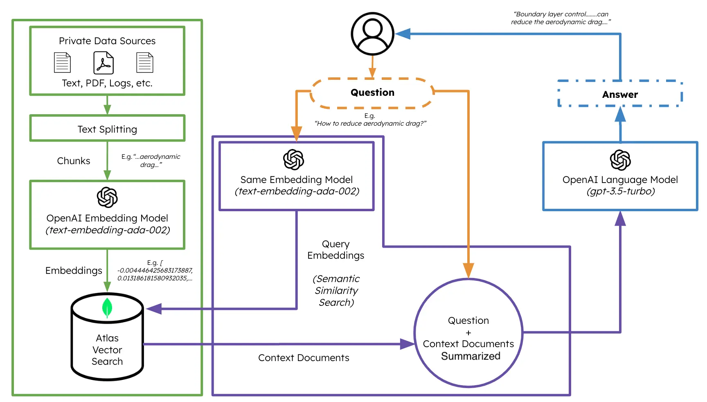

# UPDATE

Took an outdated Interactive RAG demo and changed it to use MongoDB Atlas (along with a few other changes and prompt engineering).
# VIDEO

[DEMO 1](https://apollo-fv-mneqk.mongodbstitch.com/INTERACTIVE-RAG.mp4)

[DEMO 2](https://apollo-fv-mneqk.mongodbstitch.com/IRAG.mp4)

# FLOW
1. Ask Question
2. Check VectorStore -> If VectorStore results are not enough to answer, conversationally perform a web search
3. Add/Remove sources to VectorStore
4. Fine-tune RAG strategy for desired response quality

# BUILDING A RAG-AGENT

Using [ActionWeaver](https://github.com/TengHu/ActionWeaver/tree/main), a lightweight wrapper for function calling API, we can build a user proxy agent that efficiently retrieves and ingests relevant information using MongoDB Atlas. A proxy agent is a middleman sending client requests to other servers or resources and then bringing responses back. 

This agent presents the data to the user in an interactive and customizable manner, enhancing the overall user experience.

The `UserProxyAgent` has several RAG parameters that can be customized, such as `chunk_size`(e.g. 1000), `num_sources`(e.g. 2), `unique`(e.g. True) and `min_rel_score`(e.g. 0.00).

```
class UserProxyAgent:
    def __init__(self, logger, st):
        self.rag_config = {
            "num_sources": 2,
            "source_chunk_size": 1000,
            "min_rel_score": 0.00,
            "unique": True,
        }
```

## RAG Strategy
## 
When using GenAI, users may encounter limitations when asking questions that require information not covered in the LLM's training. This can result in incorrect or evasive answers. RAG helps fill these knowledge gaps by treating the question-answering task like an "open-book quiz."

This is the "magic" that empowers the LLM to act as an agent on your behalf, and change the configuration.

```
    @action("iRAG", stop=True)
    def iRAG(self, num_sources:int, chunk_size: int, unique_sources: bool, min_rel_threshold: float):
        """
        Invoke this ONLY when the user asks you to change the RAG configuration.

        Parameters
        ----------
        num_sources : int
            how many documents should we use in the RAG pipeline?
        chunk_size : int
            how big should each chunk/source be?
        unique_sources : bool
            include only unique sources? Y=True, N=False      
        min_rel_threshold : float
            default=0.00; minimum relevance threshold to include a source in the RAG pipeline

        Returns successful response message. 
        -------
        str
            A message indicating success
        """
        with self.st.spinner(f"Changing RAG configuration..."):
            if num_sources > 0:
                self.rag_config["num_sources"] = int(num_sources)
            else:
                self.rag_config["num_sources"] = 2
            if chunk_size > 0:
                self.rag_config["source_chunk_size"] = int(chunk_size)
            else:
                self.rag_config["source_chunk_size"] = 1000
            if unique_sources == True:
                self.rag_config["unique"] = True
            else:
                self.rag_config["unique"] = False
            if min_rel_threshold:
                self.rag_config["min_rel_score"] = min_rel_threshold
            else:
                self.rag_config["min_rel_score"] = 0.00
            print(self.rag_config)
            self.st.write(self.rag_config)
            return f"New RAG config:{str(self.rag_config)}."
```

## Interactive Retrieval Augmented Generation

RAG is cool and all that, but coming up with the right "RAG strategy" is tricky. Chunk size, and the number of unique sources will have a direct impact on the response generated by the LLM. 

In developing an effective RAG strategy, the ingest process of web sources, chunking, embedding, chunk size, and the amount of sources used play crucial roles. Chunking breaks down the input text for better understanding, embedding captures the meaning, and the number of sources impacts response diversity. Finding the right balance between chunk size and the number of sources is essential for accurate and relevant responses. Experimentation and fine-tuning are necessary to determine optimal settings.

Before we dive into 'Retrieval', let's first talk about "Ingest Process"

## THE "Ingest Process"

Why have a separate process to "ingest" your content into your vector database? Using the magic of agents, we can easily add new content to the vector database.

There are many types of databases that can store these embeddings, each with its own special uses. But for tasks involving GenAI applications, I recommend MongoDB.

Think of MongoDB as a cake that you can both have and eat. It gives you the power of its language for making queries, Mongo Query Language. It also includes all the great features of MongoDB. On top of that, it lets you store these building blocks (vector embeddings) and do math operations on them, all in one place. This makes MongoDB Atlas a one-stop shop for all your vector embedding needs!


### Detailed Breakdown:  
   
1. **Vector Embeddings**: MongoDB Atlas provides the functionality to store vector embeddings at the core of your document. These embeddings are generated by converting text, video, or audio into vectors utilizing models such as GPT4All, OpenAI or Hugging Face.  

```
    @action("read_url", stop=True)
    def read_url(self, urls: List[str]):
        """
        Invoke this ONLY when the user asks you to 'read', 'add' or 'learn' some URL(s). 
        This function reads the content from specified sources, and ingests it into the Knowledgebase.
        URLs may be provided as a single string or as a list of strings.
        IMPORTANT! Use conversation history to make sure you are reading/learning/adding the right URLs.

        Parameters
        ----------
        urls : List[str]
            List of URLs to scrape.

        Returns
        -------
        str
            A message indicating successful reading of content from the provided URLs.
        """
        with self.st.spinner(f"```Analyzing the content in {urls}```"):
            loader = PlaywrightURLLoader(urls=urls, remove_selectors=["header", "footer"])  
            documents = loader.load_and_split(self.text_splitter)
            self.index.add_documents(
                    documents
            )       
            return f"```Contents in URLs {urls} have been successfully ingested (vector embeddings + content).```"
```

2. **Indexing**: When employing vector search, it's necessary to create a search index. This process entails setting up the vector path, aligning the dimensions with your chosen model, and selecting a vector function for searching the top K-nearest neighbors.  
```
{
  "mappings": {
    "dynamic": true,
    "fields": {
      "embedding": {
        "dimensions": 384, #dimensions depends on the model
        "similarity": "cosine",
        "type": "knnVector"
      }
    }
  }
}
```
3. **Query Execution**: Once the vector embeddings are indexed, an aggregation pipeline can be created on your embedded vector data to execute queries and retrieve results. This is accomplished using the $vectorSearch operator, a new aggregation stage in Atlas.

```
def recall(self, text, n_docs=2, min_rel_score=0.25, chunk_max_length=800,unique=True):
        #$vectorSearch
        print("recall=>"+str(text))
        response = self.collection.aggregate([
        {
            "$vectorSearch": {
                "index": "default",
                "queryVector": self.gpt4all_embd.embed_query(text), #GPT4AllEmbeddings()
                "path": "embedding",
                #"filter": {},
                "limit": 15, #Number (of type int only) of documents to return in the results. Value can't exceed the value of numCandidates.
                "numCandidates": 50 #Number of nearest neighbors to use during the search. You can't specify a number less than the number of documents to return (limit).
            }
        },
        {
            "$addFields": 
            {
                "score": {
                "$meta": "vectorSearchScore"
            }
        }
        },
        {
            "$match": {
                "score": {
                "$gte": min_rel_score
            }
        }
        },{"$project":{"score":1,"_id":0, "source":1, "text":1}}])
        tmp_docs = []
        str_response = []
        for d in response:
            if len(tmp_docs) == n_docs:
                break
            if unique and d["source"] in tmp_docs:
                continue
            tmp_docs.append(d["source"])
            str_response.append({"URL":d["source"],"content":d["text"][:chunk_max_length],"score":d["score"]})
        kb_output = f"Knowledgebase Results[{len(tmp_docs)}]:\n```{str(str_response)}```\n## \n```SOURCES: "+str(tmp_docs)+"```\n\n"
        self.st.write(kb_output)
        return str(kb_output)
```


## Getting Started
Create a new Python environment
```bash 
python3 -m venv env
```

Activate the new Python enviroment
```bash
source env/bin/activate
```

Install the requirements
```bash
pip3 install -r requirements.txt
```
Set the parameters in [params.py](rag/params.py):
```bash 
# MongoDB 
MONGODB_URI = ""
DATABASE_NAME = "genai"
COLLECTION_NAME = "rag"

# If using OpenAI
OPENAI_API_KEY = ""

# If using Azure OpenAI
OPENAI_TYPE = "azure"
OPENAI_API_VERSION = "2023-10-01-preview"
OPENAI_AZURE_ENDPOINT = "https://.openai.azure.com/"
OPENAI_AZURE_DEPLOYMENT = ""

```
Create a Search index with the following definition
```JSON
{
  "mappings": {
    "dynamic": true,
    "fields": {
      "embedding": {
        "dimensions": 384,
        "similarity": "cosine",
        "type": "knnVector"
      }
    }
  }
}
```

Set the environment
```bash
export OPENAI_API_KEY=
```

To run the RAG application

```bash
env/bin/streamlit run rag/app.py
```
Log information generated by the application will be appended to app.log.

## Usage
This bot supports the following actions: answer question, search the web, read URLs, remove sources, list all sources, and reset messages. 
It also supports an action called iRAG that lets you dynamically control your agent's RAG strategy. 

Ex: "set RAG config to 3 sources and chunk size 1250" => New RAG config:{'num_sources': 3, 'source_chunk_size': 1250, 'min_rel_score': 0, 'unique': True}.

```
 def __call__(self, text):
        text = self.preprocess_query(text)
        self.messages += [{"role": "user", "content":text}]
        response = self.llm.create(messages=self.messages, actions = [
            self.read_url,self.answer_question,self.remove_source,self.reset_messages,
            self.iRAG, self.get_sources_list,self.search_web
        ], stream=True)
        return response
```

If the bot is unable to provide an answer to the question from data stored in the Atlas Vector store, and your RAG strategy (number of sources, chunk size, min_rel_score, etc) it will initiate a web search to find relevant information. You can then instruct the bot to read and learn from those results. 


## Example


Since the bot is unable to provide an answer, it initiated a Google search to find relevant information.

## Tell the bot which results to learn from: 


## Change RAG strategy


## List All Sources


## Remove a source of information


## ActionWeaver Basics: What is an Agent anyway?
### Agents (according to LangChain)

The core idea of agents is to use a language model to choose a sequence of actions to take. In chains, a sequence of actions is hardcoded (in code). In agents, a language model is used as a reasoning engine to determine which actions to take and in which order.

This is the chain responsible for deciding what step to take next. This is powered by a language model and a prompt. The inputs to this chain are:

    Tools: Descriptions of available tools
    User input: The high level objective
    Intermediate steps: Any (action, tool output) pairs previously executed in order to achieve the user input

The output is the next action(s) to take or the final response to send to the user. An action specifies a tool and the input to that tool.

Different agents have different prompting styles for reasoning, different ways of encoding inputs, and different ways of parsing the output. 

### Tools

Tools are functions that an agent can invoke. There are two important design considerations around tools:

    Giving the agent access to the right tools
    Describing the tools in a way that is most helpful to the agent

Without thinking through both, you won’t be able to build a working agent. If you don’t give the agent access to a correct set of tools, it will never be able to accomplish the objectives you give it. If you don’t describe the tools well, the agent won’t know how to use them properly.


An LLM is then called, resulting in either a response to the user OR action(s) to be taken. If it is determined that a response is required, then that is passed to the user, and that cycle is finished. If it is determined that an action is required, that action is then taken, and an observation (action result) is made. That action & corresponding observation are added back to the prompt (we call this an “agent scratchpad”), and the loop resets, ie. the LLM is called again (with the updated agent scratchpad).

Large Language Models (LLMs) are great, but they have some limitations (context window, lack of access to real-time data, inability to interact with APIs, etc). LLM agents help overcome those limitations. The definition of an agent in the AI world depends on who you ask - but in a nutshell an agent empowers the LLM to take action. 


The ActionWeaver agent framework is an AI application framework that puts function-calling at its core. It is designed to enable seamless merging of traditional computing systems with the powerful reasoning capabilities of Language Model Models. 
ActionWeaver is built around the concept of LLM function calling, while popular frameworks like Langchain and Haystack are built around the concept of pipelines. 

## Key features of ActionWeaver include:
- Ease of Use: ActionWeaver allows developers to add any Python function as a tool with a simple decorator. The decorated method's signature and docstring are used as a description and passed to OpenAI's function API.
- Function Calling as First-Class Citizen: Function-calling is at the core of the framework.
- Extensibility: Integration of any Python code into the agent's toolbox with a single line of code, including tools from other ecosystems like LangChain or Llama Index.
- Function Orchestration: Building complex orchestration of function callings, including intricate hierarchies or chains.
- Debuggability: Structured logging improves the developer experience.

## Key features of OpenAI functions include:
- Function calling allows you to connect large language models to external tools.
- The Chat Completions API generates JSON that can be used to call functions in your code.
- The latest models have been trained to detect when a function should be called and respond with JSON that adheres to the function signature.
- Building user confirmation flows is recommended before taking actions that impact the world on behalf of users.
- Function calling can be used to create assistants that answer questions by calling external APIs, convert natural language into API calls, and extract structured data from text.
- The basic sequence of steps for function calling involves calling the model, parsing the JSON response, calling the function with the provided arguments, and summarizing the results back to the user.
- Function calling is supported by specific model versions, including gpt-4 and gpt-3.5-turbo.
- Parallel function calling allows multiple function calls to be performed together, reducing round-trips with the API.
- Tokens are used to inject functions into the system message and count against the model's context limit and billing.


[READ_MORE]('https://thinhdanggroup.github.io/function-calling-openai/')


## ActionWeaver Basics: actions
Developers can attach ANY Python function as a tool with a simple decorator. In the following example, we introduce action get_sources_list, which will be invoked by the OpenAI API.

ActionWeaver utilizes the decorated method's signature and docstring as a description, passing them along to OpenAI's function API.

ActionWeaver provides a light wrapper that takes care of converting the docstring/decorator information into the correct format for the OpenAI API.

```
@action(name="get_sources_list", stop=True)
    def get_sources_list(self):
        """
        Invoke this to respond to list all the available sources in your knowledge base.
        Parameters
        ----------
        None
        """
        sources = self.collection.distinct("source")  
        
        if sources:  
            result = f"Available Sources [{len(sources)}]:\n"  
            result += "\n".join(sources[:5000])  
            return result  
        else:  
            return "N/A"  
```

## ActionWeaver Basics: stop=True

stop=True when added to an action means that the LLM will immediately return the function's output, but this also restrict the LLM from making multiple function calls. For instance, if asked about the weather in NYC and San Francisco, the model would invoke two separate functions sequentially for each city. However, with `stop=True`, this process is interrupted once the first function returns weather information  for either NYC or San Francisco, depending on which city it queries first.


For a more in-depth understanding of how this bot works under the hood, please refer to the bot.py file. 
Additionally, you can explore the [ActionWeaver](https://github.com/TengHu/ActionWeaver/tree/main) repository for further details.


# ReAct Prompt Technique + Chain of Thought
Generating reasoning traces allow the model to induce, track, and update action plans, and even handle exceptions.
This example uses ReAct combined with chain-of-thought (CoT).

[Chain of Thought](https://www.promptingguide.ai/techniques/cot)

[Reasoning + Action](https://www.promptingguide.ai/techniques/react)

```
[EXAMPLES]
- User Input: What is MongoDB?
- Thought: I have to think step by step. I should not answer directly, let me check my available actions before responding.
- Observation: I have an action available "answer_question".
- Action: "answer_question"('What is MongoDB?')

- User Input: Reset chat history
- Thought: I have to think step by step. I should not answer directly, let me check my available actions before responding.
- Observation: I have an action available "reset_messages".
- Action: "reset_messages"()

- User Input: remove source https://www.google.com, https://www.example.com
- Thought: I have to think step by step. I should not answer directly, let me check my available actions before responding.
- Observation: I have an action available "remove_source".
- Action: "remove_source"(['https://www.google.com', 'https://www.example.com'])

- User Input: read https://www.google.com, https://www.example.com
- Thought: I have to think step by step. I should not answer directly, let me check my available actions before responding.
- Observation: I have an action available "read_url".
- Action: "read_url"(['https://www.google.com','https://www.example.com'])
[END EXAMPLES]
```

The core building block of our RAG-Agent is 'UserProxyAgent'. In UserProxyAgent, we use ReAct Prompt Technique to enhance the models abilities to select the right tool. GPT3.5 is not as good as GPT4 when it comes to picking the right 'action'. This type of prompt technique reduces the odds of your agent taking the wrong action.

```
class UserProxyAgent:
    def __init__(self, logger, st):
        self.rag_config = {
            "num_sources": 2,
            "source_chunk_size": 1000,
            "min_rel_score": 0.00,
            "unique": True,
        }
        self.init_messages = [
            {"role": "system", "content": "You are a resourceful AI assistant. You specialize in helping users build RAG pipelines interactively."},
            {"role": "system", "content": "Think critically and step by step. Do not answer directly. Always take the most reasonable available action."},
            {"role": "system", "content": "If user prompt is not related to modifying RAG strategy, resetting chat history, removing sources, learning sources, or a question - Respectfully decline to respond."},
            {"role":"system", "content":"""\n\n[EXAMPLES]
            - User Input: "What is kubernetes?"
            - Thought: I have an action available called "answer_question". I will use this action to answer the user's question about Kubernetes.
            - Observation: I have an action available called "answer_question". I will use this action to answer the user's question about Kubernetes.
            - Action: "answer_question"('What is kubernetes?')

            - User Input: What is MongoDB?
            - Thought: I have to think step by step. I should not answer directly, let me check my available actions before responding.
            - Observation: I have an action available "answer_question".
            - Action: "answer_question"('What is MongoDB?')

            - User Input: Reset chat history
            - Thought: I have to think step by step. I should not answer directly, let me check my available actions before responding.
            - Observation: I have an action available "reset_messages".
            - Action: "reset_messages"()

            - User Input: remove sources https://www.google.com, https://www.example.com
            - Thought: I have to think step by step. I should not answer directly, let me check my available actions before responding.
            - Observation: I have an action available "remove_source".
            - Action: "remove_source"(['https://www.google.com','https://www.example.com'])

            - User Input: add https://www.google.com, https://www.example.com
            - Thought: I have to think step by step. I should not answer directly, let me check my available actions before responding.
            - Observation: I have an action available "read_url".
            - Action: "read_url"(['https://www.google.com','https://www.example.com'])
            
            - User Input: learn https://www.google.com, https://www.example.com
            - Thought: I have to think step by step. I should not answer directly, let me check my available actions before responding.
            - Observation: I have an action available "read_url".
            - Action: "read_url"(['https://www.google.com','https://www.example.com'])
        [END EXAMPLES]\n\n
             
             ## IMPORTANT: 
                - DO NOT ANSWER DIRECTLY - ALWAYS USE AN ACTION/TOOL TO FORMULATE YOUR ANSWER
                - ALWAYS USE answer_question if USER PROMPT is a question
                - ALWAYS USE THE CORRECT TOOL/ACTION WHEN USER PROMPT IS related to modifying RAG strategy, resetting chat history, removing sources, learning sources
                - Always formulate your answer accounting for the previous messages
             """}
                         ]
        browser_options = Options()
        browser_options.headless = True
        browser_options.add_argument("--headless") 
        browser_options.add_argument('--disable-gpu')
        self.browser = webdriver.Chrome(options=browser_options)

        self.logger = logger
        self.text_splitter = RecursiveCharacterTextSplitter(
            # Set a really small chunk size, just to show.
            chunk_size=4000,
            chunk_overlap=200,
            length_function=len,
            add_start_index=True,
        )
        self.token_tracker = TokenUsageTracker(budget=None, logger=logger)
        if(params.OPENAI_TYPE != "azure"):
            self.llm = OpenAIChatCompletion(
                model="gpt-3.5-turbo",
                token_usage_tracker = TokenUsageTracker(budget=2000, logger=logger),
                logger=logger)
        else:
            self.llm = ChatCompletion(
                model="gpt-3.5-turbo", 
                #model="gpt-4", 
                azure_deployment=params.OPENAI_AZURE_DEPLOYMENT,
                azure_endpoint=params.OPENAI_AZURE_ENDPOINT, api_key=params.OPENAI_API_KEY,
                api_version=params.OPENAI_API_VERSION, 
                token_usage_tracker = TokenUsageTracker(budget=2000, logger=logger), 
                logger=logger)
        self.messages = self.init_messages
        self.times = []
        self.gpt4all_embd = GPT4AllEmbeddings()
        self.client = pymongo.MongoClient(MONGODB_URI)
        self.db = self.client[DATABASE_NAME]  
        self.collection = self.db[COLLECTION_NAME]  
        self.vectorstore = MongoDBAtlasVectorSearch(self.collection, self.gpt4all_embd)  
        self.index = self.vectorstore.from_documents([], self.gpt4all_embd, collection=self.collection)
        self.st = st
```
Then our class RAGAgent will extend UserProxyAgent.
```
class RAGAgent(UserProxyAgent):
```

RAGAgent class will contain all the actions available to the agent. 

# ACTIONS EXPLAINED
## ANSWER QUESTION
This is definitely one of the most magical functions in this Github repository. If the user asks a question, this method should be invoked first. It works by pre-processing the query, then recalling relevant documents from the knowledge base. It generates a context string from these documents which is used to formulate a precise prompt for the AI model. The prompt instructs the model to carefully consider the verified sources and formulate a response in markdown format. The method also sets various rules for the AI model such as not making up any part of an answer, keeping the response under 1200 characters, and citing verified sources in the response. If the verified sources cannot answer the question, the AI model is instructed to explain this and suggest/perform a WEB SEARCH.

```
@action(name="answer_question", stop=True)
    def answer_question(self, query: str):
        """
        ALWAYS TRY TO INVOKE THIS FIRST IF A USER ASKS A QUESTION.

        Parameters
        ----------
        query : str
            The query to be used for answering a question.
        """

        with self.st.spinner(f"Attemtping to answer question: {query}"):
            query = self.preprocess_query(query)
            context_str = str(
                self.recall(
                    query,
                    n_docs=self.rag_config["num_sources"],
                    min_rel_score=self.rag_config["min_rel_score"],
                    chunk_max_length=self.rag_config["source_chunk_size"],
                    unique=self.rag_config["unique"],
                )
            ).strip()
            PRECISE_PROMPT = """
            THINK CAREFULLY AND STEP BY STEP.
            WE WILL BE PLAYING A SPECIAL GAME. 

            Given the following verified sources and a question, using only the verified sources content create a final concise answer in markdown. 
            If VERIFIED SOURCES is not enough context to answer the question, THEN EXPLAIN YOURSELF AND KINDLY OFFER TO PERFORM A WEB SEARCH THE USERS BEHALF.

            Remember while answering:
                * The only verified sources are between START VERIFIED SOURCES and END VERIFIED SOURCES.
                * Only display images and links if they are found in the verified sources
                * If displaying images or links from the verified sources, copy the images and links exactly character for character and make sure the URL parameters are the same.
                * Do not make up any part of an answer. 
                * Questions might be vague or have multiple interpretations, you must ask follow up questions in this case.
                * Final response must be less than 1200 characters.
                * Final response must include total character count.
                * Final response must include footnotes using VERIFIED SOURCES (include URL/link).
                * IF the verified sources can answer the question in multiple different ways, THEN respond with each of the possible answers.
                * Formulate your response using ONLY VERIFIED SOURCES. IF YOU CANNOT ANSWER THE QUESTION, THEN EXPLAIN YOURSELF AND KINDLY OFFER TO PERFORM A WEB SEARCH THE USERS BEHALF.

            [START VERIFIED SOURCES]
            __context_str__
            [END VERIFIED SOURCES]


            [ACTUAL QUESTION. ANSWER ONLY BASED ON VERIFIED SOURCES]:
            __text__

            # IMPORTANT! 
                * Final response must cite verified sources used in the answer (include URL).
                * Final response must be expert quality markdown
                * The only verified sources are between START VERIFIED SOURCES and END VERIFIED SOURCES.
                * USE ONLY INFORMATION FROM VERIFIED SOURCES TO FORMULATE RESPONSE. IF VERIFIED SOURCES CANNOT ANSWER THE QUESTION, THEN EXPLAIN YOURSELF AND KINDLY OFFER TO PERFORM A WEB SEARCH THE USERS BEHALF.
                * Do not make up any part of an answer. 
            
            Begin!
            """
            PRECISE_PROMPT = str(PRECISE_PROMPT).replace("__context_str__",context_str)
            PRECISE_PROMPT = str(PRECISE_PROMPT).replace("__text__",query)

            print(PRECISE_PROMPT)
            SYS_PROMPT = """
You are a helpful AI assistant. USING ONLY THE VERIFIED SOURCES, ANSWER TO THE BEST OF YOUR ABILITY.
# IMPORTANT! 
    * Final response must cite verified sources used in the answer (include URL).
    * Final response must be expert quality markdown
"""
            self.messages += [{"role": "user", "content":PRECISE_PROMPT}]
            response = self.llm.create(messages=[
                    {"role":"system", "content":SYS_PROMPT},
                    {"role": "user", "content":PRECISE_PROMPT}
                    ], actions = [], stream=True)
            print("RESPONSE=>"+str(response))
            return response
```
## SEARCH WEB
If the knowledge base or RAG strategy does not include enough information, then we should perform a web search.
This is a little hacky, but requires no API keys thanks to Headless browsers and BeautifulSoup.

```
    @action("search_web", stop=True)
    def search_web(self,query:str) -> List:
        """
        Invoke this if you need to search the web
        Args:
            query (str): The user's query
        Returns:
            str: Text with the Google Search results
        """
        with self.st.spinner(f"Searching '{query}'..."):
            # Use the headless browser to search the web
            self.browser.get(self.encode_google_search(query))
            html = self.browser.page_source
            soup = BeautifulSoup(html, 'html.parser')
            search_results = soup.find_all('div', {'class': 'g'})

            results = []
            links = []
            for (i, result) in enumerate(search_results):
                if result.find('h3') is not None:  
                    if result.find('a')['href'] not in links and "https://" in result.find('a')['href']:
                        links.append(result.find('a')['href'])
                        results.append({'title': clean_text(result.find('h3').text), 'link': str(result.find('a')['href'])})
            
            df = pd.DataFrame(results)  
            return f"Couldn't find enough information in my knowledge base. I need the right context from verified sources. \nTo improve the response: change the RAG strategy or add/remove sources. \nHere is what I found in the web for '{query}':\n{df.to_markdown()}\n\n"
   
```
## ADD SOURCES
This method, read_url, is used to scrape and ingest content from one or more specified URLs into your knowledge base.
Uses the PlaywrightURLLoader to extract the content from the URLs.
Then uses a text splitter to turn the content into chunks.
Then loads those chunks into the vector database.

```
    @action("read_url", stop=True)
    def read_url(self, urls: List[str]):
        """
        Invoke this ONLY when the user asks you to 'read', 'add' or 'learn' some URL(s). 
        This function reads the content from specified sources, and ingests it into the Knowledgebase.
        URLs may be provided as a single string or as a list of strings.
        IMPORTANT! Use conversation history to make sure you are reading/learning/adding the right URLs.

        Parameters
        ----------
        urls : List[str]
            List of URLs to scrape.

        Returns
        -------
        str
            A message indicating successful reading of content from the provided URLs.
        """
        with self.st.spinner(f"```Analyzing the content in {urls}```"):
            loader = PlaywrightURLLoader(urls=urls, remove_selectors=["header", "footer"])  
            documents = loader.load_and_split(self.text_splitter)
            self.index.add_documents(
                    documents
            )       
            return f"```Contents in URLs {urls} have been successfully ingested (vector embeddings + content).```"
```

## LIST SOURCES
One of the most simple actions is list sources. This method, get_sources_list, is used to list all the distinct sources available in your knowledge base.

No parameters are required to call this method.

It works by querying the collection for distinct sources and then creating a list of dictionaries from the results. This list is then converted into a pandas DataFrame.

```
    @action(name="get_sources_list", stop=True)
    def get_sources_list(self):
        """
        Invoke this to respond to list all the available sources in your knowledge base.
        Parameters
        ----------
        None
        """
        sources = self.collection.distinct("source")  
        sources = [{"source": source} for source in sources]
        df = pd.DataFrame(sources)
        if sources:  
            result = f"Available Sources [{len(sources)}]:\n"  
            result += df.to_markdown()
            return result  
        else:  
            return "No sources found."  
```

## REMOVE SOURCE
This method, remove_source, is used to remove one or more sources from your knowledge base.
Uses the Python MongoDB driver to perform a delete_many

```
    @action("remove_source", stop=True)
    def remove_source(self, urls: List[str]) -> str:
        """
        Invoke this if you need to remove one or more sources
        Args:
            urls (List[str]): The list of URLs to be removed
        Returns:
            str: Text with confirmation
        """
        with self.st.spinner(f"```Removing sources {', '.join(urls)}...```"):
            self.collection.delete_many({"source": {"$in": urls}})
            return f"```Sources ({', '.join(urls)}) successfully removed.```\n"
```

## RESET MESSAGES
Nothing too crazy here, just clear the message history.

```
    @action("reset_messages", stop=True)
    def reset_messages(self) -> str:
        """
        Invoke this ONLY when the user asks you to reset chat history.

        Returns
        -------
        str
            A message indicating success
        """
        self.messages = self.init_messages
        self.st.empty()
        self.st.session_state.messages = []
        return f"Message history successfully reset."
```

## CHANGE RAG CONFIG
```
    @action("iRAG", stop=True)
    def iRAG(self, num_sources:int, chunk_size: int, unique_sources: bool, min_rel_threshold: float):
        """
        Invoke this ONLY when the user asks you to change the RAG configuration.

        Parameters
        ----------
        num_sources : int
            how many documents should we use in the RAG pipeline?
        chunk_size : int
            how big should each chunk/source be?
        unique_sources : bool
            include only unique sources? Y=True, N=False      
        min_rel_threshold : float
            default=0.00; minimum relevance threshold to include a source in the RAG pipeline

        Returns successful response message. 
        -------
        str
            A message indicating success
        """
        with self.st.spinner(f"Changing RAG configuration..."):
            if num_sources > 0:
                self.rag_config["num_sources"] = int(num_sources)
            else:
                self.rag_config["num_sources"] = 2
            if chunk_size > 0:
                self.rag_config["source_chunk_size"] = int(chunk_size)
            else:
                self.rag_config["source_chunk_size"] = 1000
            if unique_sources == True:
                self.rag_config["unique_sources"] = True
            else:
                self.rag_config["unique_sources"] = False
            if min_rel_threshold:
                self.rag_config["min_rel_score"] = min_rel_threshold
            else:
                self.rag_config["min_rel_score"] = 0.00
            print(self.rag_config)
            self.st.write(self.rag_config)
            return f"New RAG config:{str(self.rag_config)}."
```

## Credit
This was inspired by https://github.com/TengHu/Interactive-RAG

## Additional MongoDB Resources

- https://www.mongodb.com/developer/products/atlas/taking-rag-to-production-documentation-ai-chatbot/
- https://www.mongodb.com/basics/what-is-artificial-intelligence
- https://www.mongodb.com/basics/vector-databases
- https://www.mongodb.com/basics/semantic-search
- https://www.mongodb.com/basics/machine-learning-healthcare
- https://www.mongodb.com/basics/generative-ai
- https://www.mongodb.com/basics/large-language-models
- https://www.mongodb.com/basics/retrieval-augmented-generation

## Additional Reading
- https://blog.langchain.dev/openais-bet-on-a-cognitive-architecture/

## Contributing
We welcome contributions from the open-source community.

## License
Apache License 2.0
