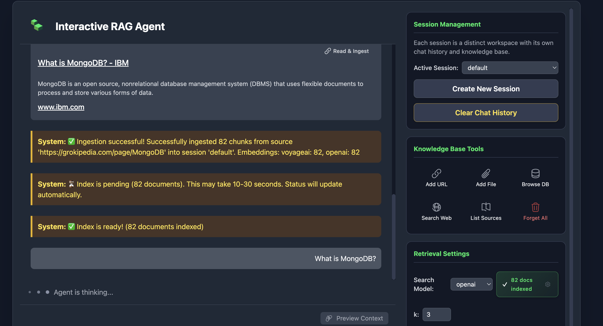

# Interactive RAG Agent




## The RAG Revolution: From Fragmented Mess to Unified Intelligence

Large Language Models (LLMs) are transforming our world, but they have a fundamental limitation: they only know what they were trained on. To make them truly useful for specific, real-world tasks, we need to ground them in our own data. This is the promise of **Retrieval-Augmented Generation (RAG)**, a technique that gives an LLM access to a relevant knowledge base.

However, many RAG systems are built on a shaky foundation. They're a fragmented mess of different databases and systems cobbled together, making them brittle, inefficient, and difficult to manage.

But there's a better way. By combining **clean data ingestion**, intelligent document **chunking**, and a **unified data architecture**, we can build RAG agents that are not just powerful, but also flexible and truly intelligent. This guide will show you how.

-----

## The Problem: The Frankenstein's Monster of RAG Architectures

Let's be honest: a typical RAG setup often looks like a digital Frankenstein. Your raw documents live in one place, their vector embeddings are stored in a separate vector database, and the metadata that gives them context is tucked away somewhere else entirely. 🧟

This siloed approach creates a nightmare for anyone trying to build, maintain, or improve the system:

  * **Painful Updates:** How do you update a single piece of information and ensure its vector and metadata are changed everywhere, atomically?
  * **Stifled Experimentation:** Want to test a new, better embedding model? Get ready to build an entirely new, parallel system and migrate all your data.
  * **Slow, Complex Queries:** Every question requires complex joins across different databases, adding latency and making the system a headache to scale.

This fragmented architecture simply can’t keep up with the pace of modern AI.

-----

## The Unified Solution: A Single Source of Truth

The key to building a smarter RAG system is to create a single source of truth using a flexible document model. Instead of scattering your data across multiple systems, every chunk of your knowledge is stored as a single, self-contained JSON document in a database like MongoDB.

```json
{
  "_id": ObjectId("..."),
  "text": "MongoDB's document model stores data as BSON documents...",
  "metadata": {
    "source": "https://www.mongodb.com/docs/",
    "source_type": "url",
    "session_id": "product_faq"
  },
  "embedding_openai": [0.123, 0.456, ...],
  "embedding_voyageai": [0.789, 0.101, ...]
}
```

This elegant structure immediately solves our biggest problems and unlocks new capabilities:

  * **🧪 Experiment in Minutes, Not Months:** The schema-agnostic model lets you store vectors from multiple embedding models in the *same document*. You can easily A/B test a new model by simply adding a new field—no complex data migration required.
  * **🎯 Achieve Pinpoint Accuracy:** You can perform a vector search while simultaneously filtering on any metadata field. This lets you instantly scope a search to a specific user session or document type, dramatically increasing the relevance of your results.

-----

## The Fuel: Pristine Data with Firecrawl.dev

Before we can chunk or embed anything, we need high-quality source material. A RAG system is only as smart as the data you feed it. If you are feeding your agent raw, messy HTML full of navigation bars, ads, and scripts, you are poisoning the well.

This is where **Firecrawl.dev** changes the game.

Instead of writing complex custom scrapers or dealing with noisy HTML, Firecrawl turns any website into **LLM-ready Markdown**. It handles the complexity of crawling—managing sub-pages, dynamic content, and caching—and returns clean, structured text that preserves the semantic hierarchy of the original content.

**Why Firecrawl?**

* **Clean Markdown:** It strips away the noise (HTML tags, footers) and gives you pure signal.
* **Crawling, not just Scraping:** Point it at a documentation root URL, and it will intelligently traverse the sub-links to build a complete knowledge base.

By starting with Firecrawl, we ensure that the "text" field in our database is rich, readable, and perfectly formatted for the next step: chunking.

-----

## The Foundation: The Art of Intelligent Chunking


With our pristine Markdown from Firecrawl in hand, we need to prepare the content. The performance of any RAG system hinges on a well-chunked knowledge base. Breaking a document into pieces sounds simple, but doing it *intelligently* is crucial.

Using a tool like **LangChain's `RecursiveCharacterTextSplitter`** is a great start. Because Firecrawl gives us Markdown, this splitter can respect headers and sections, keeping related concepts together.

You can control this process with two key "tuning knobs":

  * **Chunk Size:** A starting point of **1,000 characters** is a good balance. It's small enough for precise retrieval but large enough to contain meaningful context.
  * **Chunk Overlap:** An overlap of **150 characters** creates a contextual bridge between adjacent chunks. This ensures that an important idea isn't awkwardly split in two right at a boundary.

-----

## The Conversation: Tuning for Precision

Once your knowledge is ingested, getting the best answers requires fine-grained control over the retrieval process. Think of it as a conversation with your data, and you have the dials to control the clarity.

### The Quality Bouncer: `min_rel_score`

The **minimum relevance score** acts as a critical quality filter—like a bouncer at a club, it only lets in high-quality information. Vector search ranks results by similarity, assigning a score from 0 to 1. By setting a threshold (e.g., 0.80), you tell the agent to ignore any chunks that aren't a strong match for the query.

This empowers your agent to confidently say, "I don't know," rather than trying to invent an answer from low-quality context.

### The Context Dial: `num_sources` (k)

The **`num_sources`** parameter (often called 'k') is your context dial. It determines how many of the top-ranking chunks the agent retrieves to answer a question.

  * **For specific, factual questions,** you want a focused beam of light. A small `k` (e.g., 3) is ideal.
  * **For open-ended, brainstorming queries,** you need a floodlight. A larger `k` (e.g., 10) provides the broader context necessary for a comprehensive response.


-----

## The Agent's Edge: A Living, Organized Knowledge Base

A truly intelligent RAG agent doesn't just *read* its knowledge base—it helps *manage* it. Because each chunk is a unique document with its own `_id`, the agent can perform standard database operations.

Imagine a user points out that a company policy has changed. The agent can use a tool to execute a command like this:

`update_chunk(chunk_id='...', new_content='The new policy takes effect on Jan 1, 2026.')`

This transforms the RAG system from a static library into a **living knowledge base** that can be corrected and updated in real time. 🧠

To manage this evolving knowledge, the agent uses **sessions**—distinct workspaces with their own isolated knowledge and chat history. This ensures that when you're working on "Project Alpha," you're only getting answers from the "Project Alpha" knowledge base.

-----

## Conclusion

By moving away from fragmented architectures and embracing a unified approach, you can build AI agents that are not only more powerful but also infinitely more manageable.

The formula is clear:

1. **Ingest** cleanly with **Firecrawl.dev**.
2. **Store** intelligently with **MongoDB**.
3. **Retrieve** precisely with tunable parameters.

Most importantly, by treating each chunk as a self-contained, editable entity, your knowledge base can grow and evolve. This is the foundation for a truly dynamic and intelligent AI system, ready for the future.

-----

-----

## Appendix: Under the Hood of a Unified RAG System

### The Strategic Value of a Single Document

So, why is keeping everything in one document so revolutionary for RAG? Let's revisit the hard questions posed by fragmented systems:

  * **How do you A/B test a new embedding model** without building an entirely new system and migrating all your data?
  * **How do you perform a similarity search that's also filtered by user metadata** (like `session_id`) without slow, expensive joins between databases?
  * **How do you update or delete a single chunk** and guarantee its vector and metadata are handled atomically?

The unified document model solves these problems with elegance. A single ingestion process can generate embeddings from multiple models and store them right next to the text and its metadata.

```json
{
  "text": "# The Quick Brown Fox\n\n The quick brown fox jumps...",
  "metadata": {
    "source": "example.com/story",
    "session_id": "project_alpha",
    "crawler": "firecrawl"
  },
  "embedding_openai": [0.01, 0.02, ...],
  "embedding_voyageai": [0.98, 0.97, ...]
}
```

This structure provides immense flexibility and future-proofs your architecture. As better models emerge, you can adopt them without disruption.

### The Agent's Toolkit: Tools and Pipelines

The agent interacts with this unified database using **tools**. In a framework like LangChain, a tool is a function the LLM can decide to call based on the user's query.

Our `search_knowledge_base` tool is powered by a **MongoDB Aggregation Pipeline**, which is where the magic happens.

```python
@tool
def search_knowledge_base(query: str, embedding_model: str, num_sources: int = 3) -> str:
    """Query the knowledge base to find relevant chunks for `query`."""
    
    # Select the correct vector field based on the user's choice
    model_config = EMBEDDING_CONFIG[embedding_model]
    query_vector = config.embedding_clients[embedding_model].embed_query(query)

    pipeline = [
        # Stage 1: Perform the vector search and metadata filtering in one step
        {
            "$vectorSearch": {
                "index": model_config['index_name'],
                "path": model_config['vector_field'], # Dynamically use the right embedding
                "queryVector": query_vector,
                "limit": num_sources,
                "numCandidates": num_sources * 10,
                "filter": {
                    # Only search within the current user's session
                    "metadata.session_id": {"$eq": config.current_session}
                }
            }
        },
        # Stage 2: Reshape the output for the LLM
        {
            "$project": {
                "score": {"$meta": "vectorSearchScore"},
                "content": "$text",
                "source": "$metadata.source"
            }
        }
    ]
    results = list(config.collection.aggregate(pipeline))
    return format_results(results)
```

This pipeline is where the power of the unified model becomes clear. The `$vectorSearch` stage efficiently finds the most semantically similar chunks while *simultaneously* applying a `filter` on the metadata. This is a highly optimized, single-database operation that is far more efficient than coordinating searches across separate systems. This architecture paves the way for even more advanced strategies, all within the same powerful pipeline.