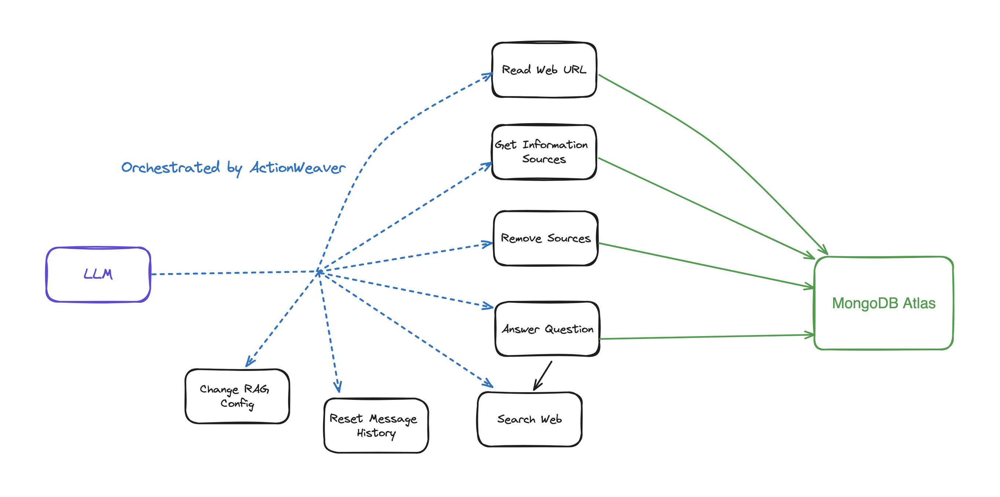

# INTRODUCTION

Agents are revolutionizing the way we leverage language models for decision-making and task performance. Agents are systems that use language models to make decisions and perform tasks. They are designed to handle complex scenarios and provide more flexibility compared to traditional approaches. Agents can be thought of as reasoning engines that leverage language models to process information, retrieve relevant data, ingest(chunk/embed) and generate responses. 

In the future, agents will play a vital role in processing text, automating tasks, and improving human-computer interactions as language models advance.

In this example, we will specifically focus on leveraging agents in dynamic Retrieval Augmented Generation (RAG). Using ActionWeaver and MongoDB Atlas, you will have the ability to modify your RAG strategy in real-time through conversational interactions. Whether it's selecting more chunks, increasing chunk size, or tweaking other parameters, you can fine-tune your RAG approach to achieve the desired response quality and accuracy. You can even add/remove sources to your vector database using natural language! 


## 

# VIDEO

[DEMO 1](https://apollo-fv-mneqk.mongodbstitch.com/IRAG.mp4)

# FLOW
1. Ask Question
2. Check VectorStore -> If VectorStore results are not enough to answer, conversationally perform a web search
3. Add/Remove sources to VectorStore
4. Fine-tune RAG strategy for desired response quality 


## Getting Started
Create a new Python environment
```bash 
python3 -m venv env
```

Activate the new Python enviroment
```bash
source env/bin/activate
```

Install the requirements
```bash
pip3 install -r requirements.txt
```
Set the parameters in [params.py](rag/params.py):
```bash 
# MongoDB 
MONGODB_URI = ""
DATABASE_NAME = "genai"
COLLECTION_NAME = "rag"

# If using OpenAI
OPENAI_API_KEY = ""

# If using Azure OpenAI
OPENAI_TYPE = "azure"
OPENAI_API_VERSION = "2023-10-01-preview"
OPENAI_AZURE_ENDPOINT = "https://.openai.azure.com/"
OPENAI_AZURE_DEPLOYMENT = ""

```
Create a Search index with the following definition
```JSON
{
  "mappings": {
    "dynamic": true,
    "fields": {
      "embedding": {
        "dimensions": 384,
        "similarity": "cosine",
        "type": "knnVector"
      }
    }
  }
}
```

Set the environment
```bash
export OPENAI_API_KEY=
```

To run the RAG application

```bash
env/bin/streamlit run rag/app.py
```
Log information generated by the application will be appended to app.log.

## Usage
This bot supports the following actions: answer question, search the web, read URLs, remove sources, list all sources, and reset messages. 
It also supports an action called iRAG that lets you dynamically control your agent's RAG strategy. 

Ex: "set RAG config to 3 sources and chunk size 1250" => New RAG config:{'num_sources': 3, 'source_chunk_size': 1250, 'min_rel_score': 0, 'unique': True}.

```
 def __call__(self, text):
        text = self.preprocess_query(text)
        self.messages += [{"role": "user", "content":text}]
        response = self.llm.create(messages=self.messages, actions = [
            self.read_url,self.answer_question,self.remove_source,self.reset_messages,
            self.iRAG, self.get_sources_list,self.search_web
        ], stream=True)
        return response
```

If the bot is unable to provide an answer to the question from data stored in the Atlas Vector store, and your RAG strategy (number of sources, chunk size, min_rel_score, etc) it will initiate a web search to find relevant information. You can then instruct the bot to read and learn from those results. 

## Interactive Retrieval Augmented Generation

RAG is cool and all that, but coming up with the right "RAG strategy" is tricky. Chunk size, and the number of unique sources will have a direct impact on the response generated by the LLM. 

In developing an effective RAG strategy, the ingest process of web sources, chunking, embedding, chunk size, and the amount of sources used play crucial roles. Chunking breaks down the input text for better understanding, embedding captures the meaning, and the number of sources impacts response diversity. Finding the right balance between chunk size and the number of sources is essential for accurate and relevant responses. Experimentation and fine-tuning are necessary to determine optimal settings.

Before we dive into 'Retrieval', let's first talk about "Ingest Process"

## The "Ingest Process"

Why have a separate process to "ingest" your content into your vector database? Using the magic of agents, we can easily add new content to the vector database.

There are many types of databases that can store these embeddings, each with its own special uses. But for tasks involving GenAI applications, I recommend MongoDB.

Think of MongoDB as a cake that you can both have and eat. It gives you the power of its language for making queries, Mongo Query Language. It also includes all the great features of MongoDB. On top of that, it lets you store these building blocks (vector embeddings) and do math operations on them, all in one place. This makes MongoDB Atlas a one-stop shop for all your vector embedding needs!


### Detailed Breakdown:  
   
1. **Vector Embeddings**: MongoDB Atlas provides the functionality to store vector embeddings at the core of your document. These embeddings are generated by converting text, video, or audio into vectors utilizing models such as GPT4All, OpenAI or Hugging Face.  

```
    @action("read_url", stop=True)
    def read_url(self, urls: List[str]):
        """
        Invoke this ONLY when the user asks you to 'read', 'add' or 'learn' some URL(s). 
        This function reads the content from specified sources, and ingests it into the Knowledgebase.
        URLs may be provided as a single string or as a list of strings.
        IMPORTANT! Use conversation history to make sure you are reading/learning/adding the right URLs.

        Parameters
        ----------
        urls : List[str]
            List of URLs to scrape.

        Returns
        -------
        str
            A message indicating successful reading of content from the provided URLs.
        """
        with self.st.spinner(f"```Analyzing the content in {urls}```"):
            loader = PlaywrightURLLoader(urls=urls, remove_selectors=["header", "footer"])  
            documents = loader.load_and_split(self.text_splitter)
            self.index.add_documents(
                    documents
            )       
            return f"```Contents in URLs {urls} have been successfully ingested (vector embeddings + content).```"
```

2. **Indexing**: When employing vector search, it's necessary to create a search index. This process entails setting up the vector path, aligning the dimensions with your chosen model, and selecting a vector function for searching the top K-nearest neighbors.  
```
{
  "mappings": {
    "dynamic": true,
    "fields": {
      "embedding": {
        "dimensions": 384, #dimensions depends on the model
        "similarity": "cosine",
        "type": "knnVector"
      }
    }
  }
}
```
3. **Query Execution**: Once the vector embeddings are indexed, an aggregation pipeline can be created on your embedded vector data to execute queries and retrieve results. This is accomplished using the $vectorSearch operator, a new aggregation stage in Atlas.

```
def recall(self, text, n_docs=2, min_rel_score=0.25, chunk_max_length=800,unique=True):
        #$vectorSearch
        print("recall=>"+str(text))
        response = self.collection.aggregate([
        {
            "$vectorSearch": {
                "index": "default",
                "queryVector": self.gpt4all_embd.embed_query(text), #GPT4AllEmbeddings()
                "path": "embedding",
                #"filter": {},
                "limit": 15, #Number (of type int only) of documents to return in the results. Value can't exceed the value of numCandidates.
                "numCandidates": 50 #Number of nearest neighbors to use during the search. You can't specify a number less than the number of documents to return (limit).
            }
        },
        {
            "$addFields": 
            {
                "score": {
                "$meta": "vectorSearchScore"
            }
        }
        },
        {
            "$match": {
                "score": {
                "$gte": min_rel_score
            }
        }
        },{"$project":{"score":1,"_id":0, "source":1, "text":1}}])
        tmp_docs = []
        str_response = []
        for d in response:
            if len(tmp_docs) == n_docs:
                break
            if unique and d["source"] in tmp_docs:
                continue
            tmp_docs.append(d["source"])
            str_response.append({"URL":d["source"],"content":d["text"][:chunk_max_length],"score":d["score"]})
        kb_output = f"Knowledgebase Results[{len(tmp_docs)}]:\n```{str(str_response)}```\n## \n```SOURCES: "+str(tmp_docs)+"```\n\n"
        self.st.write(kb_output)
        return str(kb_output)
```


# BUILDING A RAG-AGENT

Using [ActionWeaver](https://github.com/TengHu/ActionWeaver/tree/main), a lightweight wrapper for function calling API, we can build a user proxy agent that efficiently retrieves and ingests relevant information using MongoDB Atlas. 

A proxy agent is a middleman sending client requests to other servers or resources and then bringing responses back. 

This agent presents the data to the user in an interactive and customizable manner, enhancing the overall user experience.

The `UserProxyAgent` has several RAG parameters that can be customized, such as `chunk_size`(e.g. 1000), `num_sources`(e.g. 2), `unique`(e.g. True) and `min_rel_score`(e.g. 0.00).

```
class UserProxyAgent:
    def __init__(self, logger, st):
        self.rag_config = {
            "num_sources": 2,
            "source_chunk_size": 1000,
            "min_rel_score": 0.00,
            "unique": True,
        }
```

## Why Choose ActionWeaver? 
Here are some key benefits that influenced our decision to choose ActionWeaver:
1. Lightweight and Single-Purposed: ActionWeaver is very lightweight and designed with a singular focus on building LLM applications with function calling. This specialization ensures that it excels in its core function without unnecessary complexity.
2. Ease of Use:  ActionWeaver streamlines the process of integrating external tools into agent's toolkit. Using a simple decorator, developers can effortlessly add any Python function, and it also provides the flexibility to include tools from other ecosystems like LangChain or Llama Index.
3. Versatility: Despite its simplicity, ActionWeaver offers a wide range of capabilities, including support for forced function execution, parallel function calling and structured data extraction. Such versatility makes it a Swiss Army knife, equipped to handle a variety of AI-related tasks and adapt seamlessly to changing project demands.
4. Minimal Dependency: ActionWeaver has minimal dependencies, relying only on the openai and pydantic libraries. This reduces the overhead of managing dependencies.
5. Complex Function Orchestration: The framework empowers us to create intricate sequences of function calls, allowing us to build complex hierarchies or chains of functions. This capability enables us to execute sophisticated workflows with ease. 

## ActionWeaver Basics: What is an Agent anyway?

An agent is basically just a computer program or system designed to perceive its environment, make decisions, and achieve specific goals.

Think of an agent as a software entity that displays some degree of autonomy and performs actions in its environment on behalf of its user or owner, but in a relatively independent way. It takes initiatives to perform actions on its own by deliberating its options to achieve its goal(s). The core idea of agents is to use a language model to choose a sequence of actions to take. In contrast to chains, where a sequence of actions is hardcoded in code, agents use a language model as a reasoning engine to determine which actions to take and in which order.

### Actions

Actions are functions that an agent can invoke. There are two important design considerations around actions:

    Giving the agent access to the right actions
    Describing the actions in a way that is most helpful to the agent

Without thinking through both, you won’t be able to build a working agent. If you don’t give the agent access to a correct set of actions, it will never be able to accomplish the objectives you give it. If you don’t describe the actions well, the agent won’t know how to use them properly.


An LLM is then called, resulting in either a response to the user OR action(s) to be taken. If it is determined that a response is required, then that is passed to the user, and that cycle is finished. If it is determined that an action is required, that action is then taken, and an observation (action result) is made. That action & corresponding observation are added back to the prompt (we call this an “agent scratchpad”), and the loop resets, ie. the LLM is called again (with the updated agent scratchpad).

In ActionWeaver, we can influence the loop adding `stop=True|False` to an action. 
If `stop=True`, the LLM will immediately return the function's output. This will also restrict the LLM from making multiple function calls.
In this demo we will only be using `stop=True`

ActionWeaver also supports more complex loop control using `orch_expr(SelectOne[actions])` and `orch_expr(RequireNext[actions])`, but I'll leave that for PART II.


The ActionWeaver agent framework is an AI application framework that puts function-calling at its core. It is designed to enable seamless merging of traditional computing systems with the powerful reasoning capabilities of Language Model Models. 
ActionWeaver is built around the concept of LLM function calling, while popular frameworks like Langchain and Haystack are built around the concept of pipelines. 

## Key features of ActionWeaver include:
- Ease of Use: ActionWeaver allows developers to add any Python function as a tool with a simple decorator. The decorated method's signature and docstring are used as a description and passed to OpenAI's function API.
- Function Calling as First-Class Citizen: Function-calling is at the core of the framework.
- Extensibility: Integration of any Python code into the agent's toolbox with a single line of code, including tools from other ecosystems like LangChain or Llama Index.
- Function Orchestration: Building complex orchestration of function callings, including intricate hierarchies or chains.
- Debuggability: Structured logging improves the developer experience.

## Key features of OpenAI functions include:
- Function calling allows you to connect large language models to external tools.
- The Chat Completions API generates JSON that can be used to call functions in your code.
- The latest models have been trained to detect when a function should be called and respond with JSON that adheres to the function signature.
- Building user confirmation flows is recommended before taking actions that impact the world on behalf of users.
- Function calling can be used to create assistants that answer questions by calling external APIs, convert natural language into API calls, and extract structured data from text.
- The basic sequence of steps for function calling involves calling the model, parsing the JSON response, calling the function with the provided arguments, and summarizing the results back to the user.
- Function calling is supported by specific model versions, including gpt-4 and gpt-3.5-turbo.
- Parallel function calling allows multiple function calls to be performed together, reducing round-trips with the API.
- Tokens are used to inject functions into the system message and count against the model's context limit and billing.


Read more at: https://thinhdanggroup.github.io/function-calling-openai/


## ActionWeaver Basics: actions
Developers can attach ANY Python function as a tool with a simple decorator. In the following example, we introduce action get_sources_list, which will be invoked by the OpenAI API.

ActionWeaver utilizes the decorated method's signature and docstring as a description, passing them along to OpenAI's function API.

ActionWeaver provides a light wrapper that takes care of converting the docstring/decorator information into the correct format for the OpenAI API.

```
@action(name="get_sources_list", stop=True)
    def get_sources_list(self):
        """
        Invoke this to respond to list all the available sources in your knowledge base.
        Parameters
        ----------
        None
        """
        sources = self.collection.distinct("source")  
        
        if sources:  
            result = f"Available Sources [{len(sources)}]:\n"  
            result += "\n".join(sources[:5000])  
            return result  
        else:  
            return "N/A"  
```

## ActionWeaver Basics: stop=True

stop=True when added to an action means that the LLM will immediately return the function's output, but this also restrict the LLM from making multiple function calls. For instance, if asked about the weather in NYC and San Francisco, the model would invoke two separate functions sequentially for each city. However, with `stop=True`, this process is interrupted once the first function returns weather information  for either NYC or San Francisco, depending on which city it queries first.


For a more in-depth understanding of how this bot works under the hood, please refer to the bot.py file. 
Additionally, you can explore the [ActionWeaver](https://github.com/TengHu/ActionWeaver/tree/main) repository for further details.


# ReAct Prompt Technique + Chain of Thought
Generating reasoning traces allow the model to induce, track, and update action plans, and even handle exceptions.
This example uses ReAct combined with chain-of-thought (CoT).

[Chain of Thought](https://www.promptingguide.ai/techniques/cot)

[Reasoning + Action](https://www.promptingguide.ai/techniques/react)

```
[EXAMPLES]
- User Input: What is MongoDB?
- Thought: I have to think step by step. I should not answer directly, let me check my available actions before responding.
- Observation: I have an action available "answer_question".
- Action: "answer_question"('What is MongoDB?')

- User Input: Reset chat history
- Thought: I have to think step by step. I should not answer directly, let me check my available actions before responding.
- Observation: I have an action available "reset_messages".
- Action: "reset_messages"()

- User Input: remove source https://www.google.com, https://www.example.com
- Thought: I have to think step by step. I should not answer directly, let me check my available actions before responding.
- Observation: I have an action available "remove_source".
- Action: "remove_source"(['https://www.google.com', 'https://www.example.com'])

- User Input: read https://www.google.com, https://www.example.com
- Thought: I have to think step by step. I should not answer directly, let me check my available actions before responding.
- Observation: I have an action available "read_url".
- Action: "read_url"(['https://www.google.com','https://www.example.com'])
[END EXAMPLES]
```

Both Chain of Thought (CoT) and ReAct prompting techniques come into play in these examples. Here's how:

**Chain of Thought (CoT) Prompting:**

* **Reasoning**: In each example, the model uses internal reasoning before responding. It doesn't directly answer the user input but instead thinks through the steps involved:
    * Identifying available actions ("answer_question", "reset_messages", "remove_source", "read_url")
    * Choosing the appropriate action based on the user input
    * Executing the chosen action
* **Observation**: The model observes the available actions before taking any action. This allows it to be more deliberate and avoid making mistakes.
* **Action**: The model then executes the chosen action, resulting in the desired outcome.

**ReAct Prompting:**

* **Synergy between reasoning and acting**: ReAct builds upon CoT by adding a further level of interaction with the environment. This allows the model to:
    * **Gather additional information**: In some cases, the model may need more information from the environment before taking action. For example, in the "read_url" example, the model needs to read the content of the specified URLs before it can answer any questions about them.
    * **Update action plans**: Based on the gathered information, the model can revise its initial plan and adjust its actions accordingly.
    * **Make decisions in real-time**: ReAct allows the model to interact with its environment and react to changes in real-time. This makes it more adaptable and versatile in complex situations.

In summary, both CoT and ReAct play a crucial role in these examples. CoT enables the model to reason step-by-step and choose appropriate actions, while ReAct extends this functionality by allowing the model to interact with its environment and update its plans accordingly. This combination of reasoning and action makes large language models more flexible and versatile, enabling them to handle a wider range of tasks and situations.

## DEMO


Since the bot is unable to provide an answer, it initiated a Google search to find relevant information.

## Tell the bot which results to learn from: 


## Change RAG strategy


## List All Sources


## Remove a source of information


## Credit
This was inspired by https://github.com/TengHu/Interactive-RAG

## Additional MongoDB Resources

- https://www.mongodb.com/developer/products/atlas/taking-rag-to-production-documentation-ai-chatbot/
- https://www.mongodb.com/basics/what-is-artificial-intelligence
- https://www.mongodb.com/basics/vector-databases
- https://www.mongodb.com/basics/semantic-search
- https://www.mongodb.com/basics/machine-learning-healthcare
- https://www.mongodb.com/basics/generative-ai
- https://www.mongodb.com/basics/large-language-models
- https://www.mongodb.com/basics/retrieval-augmented-generation

## Additional Reading
- https://blog.langchain.dev/openais-bet-on-a-cognitive-architecture/

## Contributing
We welcome contributions from the open-source community.

## License
Apache License 2.0
