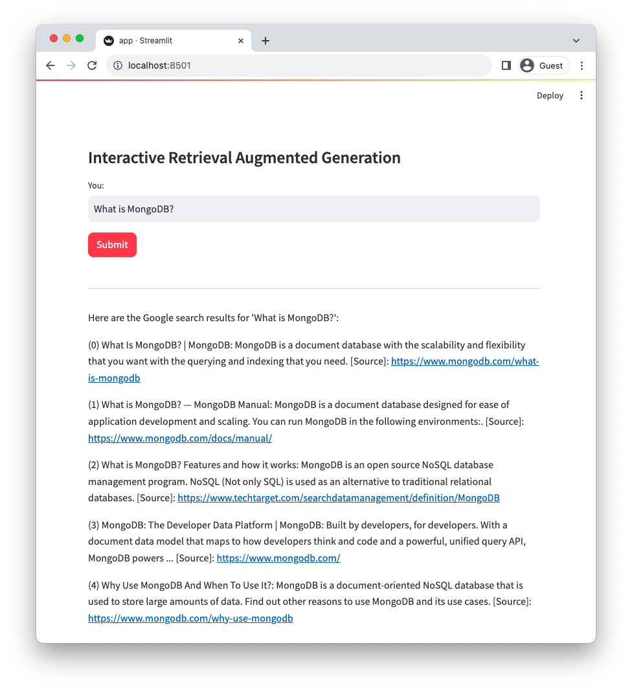
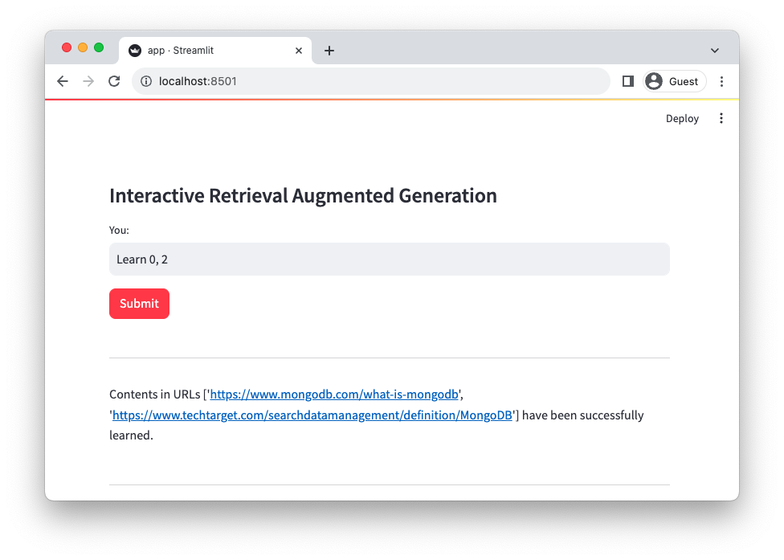
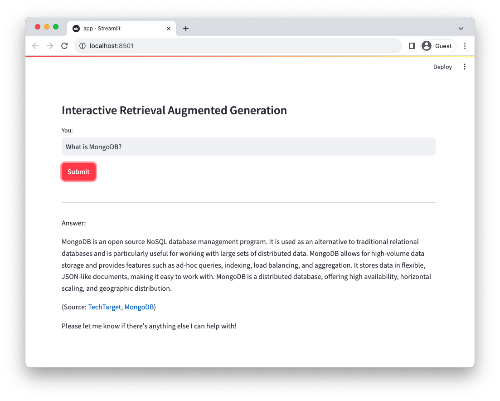
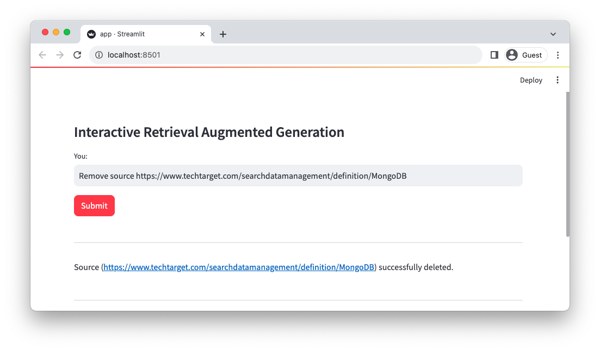
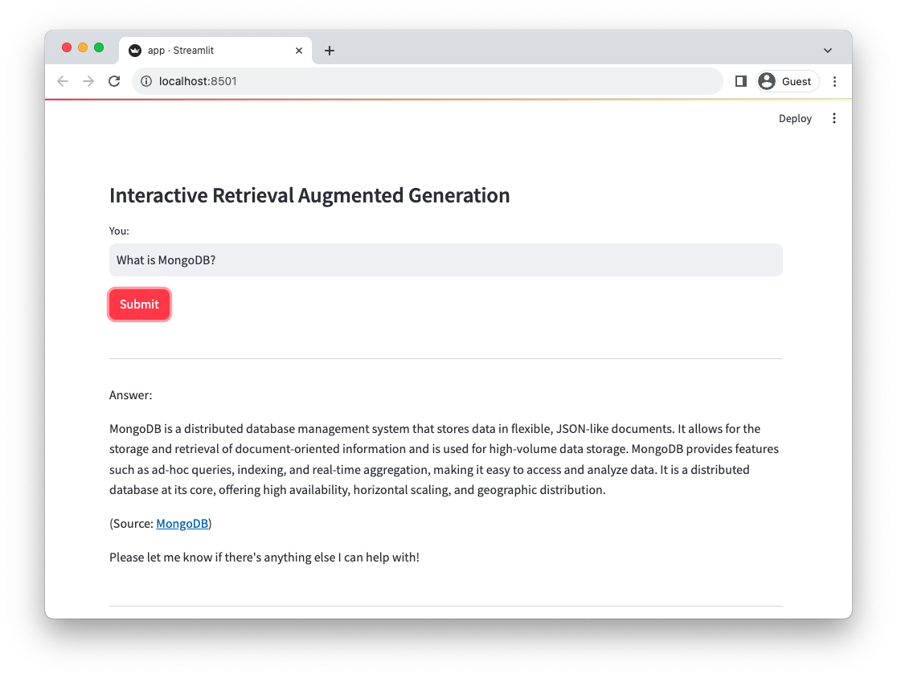

# UPDATE

Took an outdated Interactive RAG demo and changed it to use MongoDB Atlas (along with a few other changes and prompt engineering).

# FLOW
1. Ask Question
2. Check VectorStore -> If nothing, google. If something, respond.
3. Add/Remove sources conversationally

# VIDEO

[DEMO](https://apollo-fv-mneqk.mongodbstitch.com/INTERACTIVE-RAG.mp4)

# ReAct Prompt Technique + Chain of Thought
Generating reasoning traces allow the model to induce, track, and update action plans, and even handle exceptions.
This example uses ReAct combined with chain-of-thought (CoT).

[Chain of Thought](https://www.promptingguide.ai/techniques/cot)

[Reasoning + Action](https://www.promptingguide.ai/techniques/react)

```
[EXAMPLES]
- User Input: What is MongoDB?
- Thought: I have to think step by step. I should not answer directly, let me check my available actions before responding.
- Observation: I have an action available "answer_question".
- Action: "answer_question"('What is MongoDB?')

- User Input: Reset chat history
- Thought: I have to think step by step. I should not answer directly, let me check my available actions before responding.
- Observation: I have an action available "reset_messages".
- Action: "reset_messages"()

- User Input: remove source https://www.google.com
- Thought: I have to think step by step. I should not answer directly, let me check my available actions before responding.
- Observation: I have an action available "remove_source".
- Action: "remove_source"('https://www.google.com')

- User Input: read https://www.google.com, https://www.example.com
- Thought: I have to think step by step. I should not answer directly, let me check my available actions before responding.
- Observation: I have an action available "read_url".
- Action: "read_url"(['https://www.google.com','https://www.example.com'])
[END EXAMPLES]
```

# Interactive Retrieval Augmented Generation

This demo app uses [ActionWeaver](https://github.com/TengHu/ActionWeaver/tree/main) to organize and orchestrate tools/functions and implement an interactive RAG bot.

This demo app is not intended for use in production environments.

## Getting Started

Install the requirements
```bash
pip3 install -r requirements.txt
```
Set the parameters
```bash 
SERPAPI_KEY = ""
MONGODB_URI = "" 
DATABASE_NAME = ""
COLLECTION_NAME = ""
OPENAI_API_KEY = ""
OPENAI_TYPE = "azure"
OPENAI_API_VERSION = "2023-10-01-preview"
OPENAI_AZURE_ENDPOINT = "https://.openai.azure.com/"
OPENAI_AZURE_DEPLOYMENT = ""

```
Create a Search index with the following definition
```JSON
{
  "mappings": {
    "dynamic": true,
    "fields": {
      "embedding": {
        "type": "knnVector",
        "dimensions": 354,
        "similarity": "euclidean"
      }
    }
  }
}
```
To run the RAG application

```bash
streamlit run rag/app.py
```
Log information generated by the application will be appended to app.log.

## Usage
This bot supports four actions: answer question, read URLs, remove source, and reset message.

If the bot is unable to provide an answer to the question from data stored in the Atlas Vector store, it will initiate a Google search to find relevant information. You can then instruct the bot to read and learn from those results. 


### Example



Since the bot is unable to provide an answer, it initiated a Google search to find relevant information.

Tell the bot which results to learn from: 



Search again



Remove a source of information



Ask again




For a more in-depth understanding of how this bot works under the hood, please refer to the bot.py file. 
Additionally, you can explore the [ActionWeaver](https://github.com/TengHu/ActionWeaver/tree/main) repository for further details.


## Credit
This was inspired by https://github.com/TengHu/Interactive-RAG


## Contributing
We welcome contributions from the open-source community.

## License
Apache License 2.0
