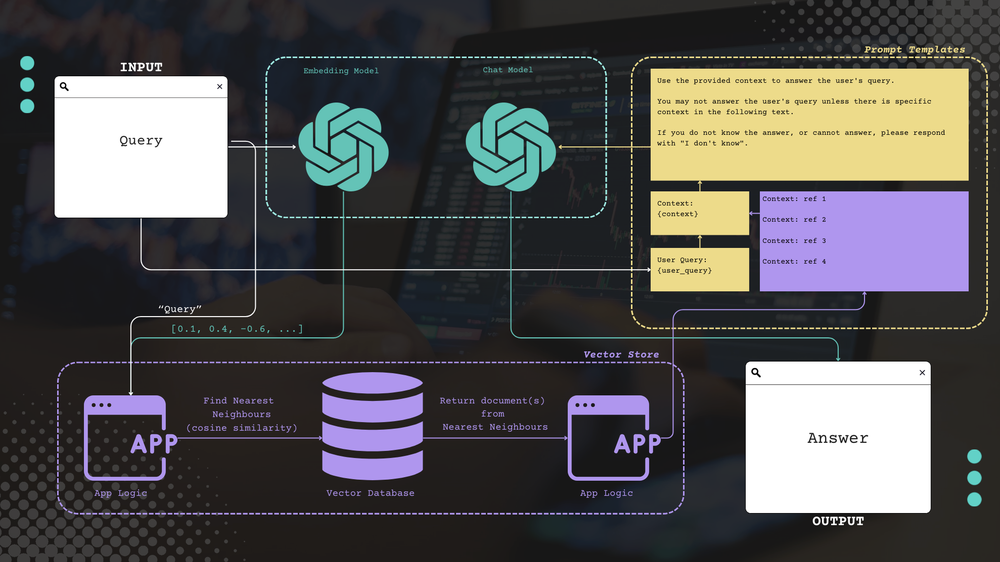
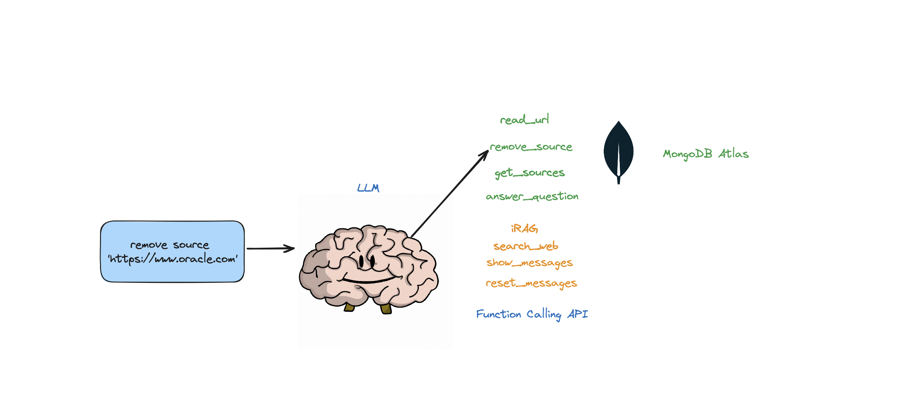
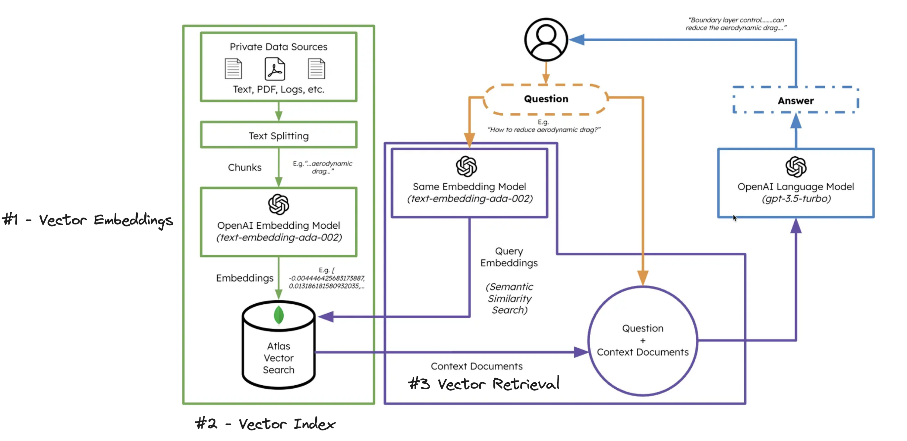
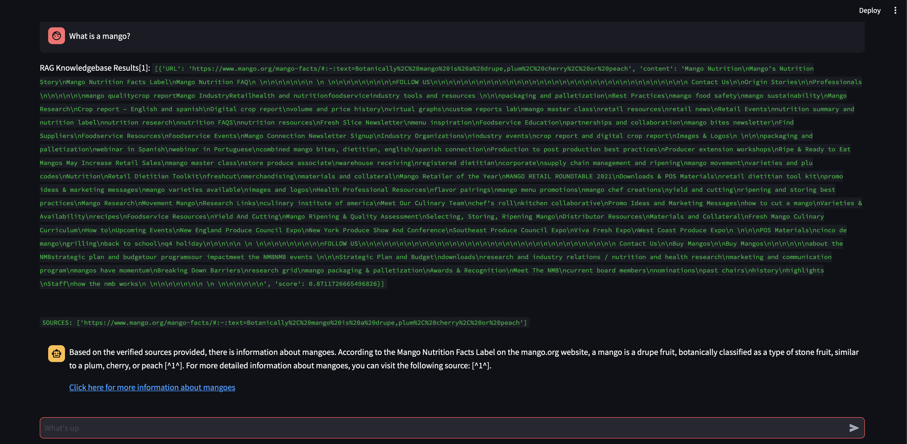
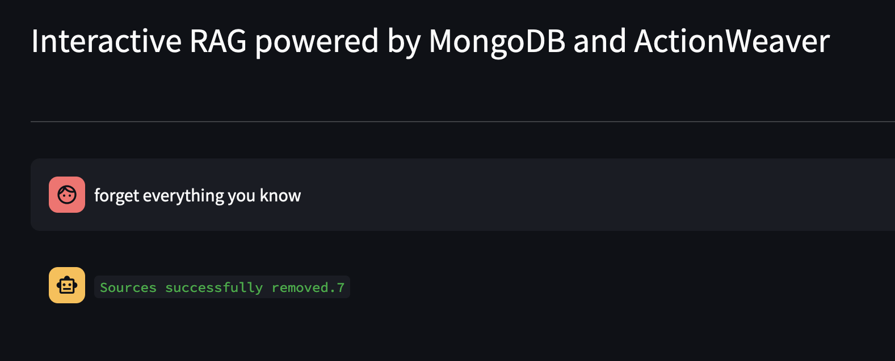

# Interactive RAG with MongoDB Atlas + Function Calling API
## Introduction: Unveiling the Power of Interactive Knowledge Discovery

Imagine yourself as a detective investigating a complex case. Traditional Retrieval Augmented Generation (RAG) acts as your static assistant, meticulously sifting through mountains of evidence based on a pre-defined strategy. While helpful, this approach lacks the flexibility needed for today's ever-changing digital landscape.

Enter Interactive RAG – the next generation of information access. It empowers users to become active knowledge investigators by:

* **Dynamically adjusting retrieval strategies:** Tailor the search to your specific needs by fine-tuning parameters like the number of sources, chunk size, and retrieval algorithms.
* **Stay ahead of the curve:**  As new information emerges, readily incorporate it into your retrieval strategy to stay up-to-date and relevant.
* **Enhancing LLM performance:** Optimize the LLM's workload by dynamically adjusting the information flow, leading to faster and more accurate analysis.

##### BEFORE YOU CONTINUE, MAKE SURE YOU

- [Understand the basics of LLMs](https://www.mongodb.com/basics/large-language-modelss)
- [Understand the basic concept of RAG](https://www.mongodb.com/basics/retrieval-augmented-generation)
- [Understand the basics of using a vector database](https://www.mongodb.com/basics/vector-databases)

## 
(_image from  [Session 7: RAG Evaluation with RAGAS and How to Improve Retrieval](https://www.youtube.com/watch?v=mEv-2Xnb_Wk))_

## Optimizing Your Retrieval Strategy: Static vs. Interactive RAG

Choosing between static and interactive Retrieval Augmented Generation (RAG) approaches is crucial for optimizing your application's retrieval strategy. Each approach offers unique advantages and disadvantages, tailored to specific use cases:

**Static RAG:** A Static RAG approach is pre-trained on a fixed knowledge base, meaning the information it can access and utilize is predetermined and unchanging. This allows for faster inference times and lower computational costs, making it ideal for applications requiring real-time responses, such as chatbots and virtual assistants.

**Pros:**

* **Faster Response:** Pre-loaded knowledge bases enable rapid inference, ideal for real-time applications like chatbots and virtual assistants.
* **Lower Cost:** Static RAG requires fewer resources for training and maintenance, making them suitable for resource-constrained environments.
* **Controlled Content:** Developers have complete control over the model's knowledge base, ensuring targeted and curated responses in sensitive applications.
* **Consistent Results:** Static RAG provides stable outputs even when underlying data changes, ensuring reliability in data-intensive scenarios.

**Cons:**

* **Limited Knowledge:** Static RAG is confined to their pre-loaded knowledge, limiting their versatility compared to Interactive RAG accessing external data.
* **Outdated Information:** Static knowledge bases can become outdated, leading to inaccurate or irrelevant responses if not frequently updated.
* **Less Adaptable:** Static RAG can struggle to adapt to changing user needs and preferences, limiting their ability to provide personalized or context-aware responses.

**Interactive RAG:** An Interactive RAG approach is trained on a dynamic knowledge base, allowing it to access and process real-time information from external sources such as online databases and APIs. This enables it to provide up-to-date and relevant responses, making it suitable for applications requiring access to constantly changing data.

**Pros:**

* **Up-to-Date Information:** Interactive RAG can access and process real-time external information, ensuring current and relevant responses, particularly valuable for applications requiring access to frequently changing data.
* **Greater Flexibility:** Interactive RAG can adapt to user needs and preferences by incorporating feedback and interactions into their responses, enabling personalized and context-aware experiences.
* **Vast Knowledge Base:** Access to external information provides an almost limitless knowledge pool, allowing Interactive RAG to address a wider range of queries and deliver comprehensive and informative responses.

**Cons:**

* **Slower Response:** Processing external information increases inference time, potentially hindering real-time applications.
* **Higher Cost:** Interactive RAG requires more computational resources, making them potentially unsuitable for resource-constrained environments.
* **Bias Risk:** External information sources may contain biases or inaccuracies, leading to biased or misleading responses if not carefully mitigated.
* **Security Concerns:** Accessing external sources introduces potential data security risks, requiring robust security measures to protect sensitive information.

**Choosing the Right Approach:**

While this tutorial focuses specifically on Interactive RAG, the optimal approach depends on your application's specific needs and constraints. Consider:

* **Data Size & Update Frequency:** Static models are suitable for static or infrequently changing data, while interactive RAG is necessary for frequently changing data.
* **Real-Time Requirements:** Choose static RAG for applications requiring fast response times. For less critical applications, interactive RAG may be preferred.
* **Computational Resources:** Evaluate your available resources when choosing between static and interactive approaches.
* **Data Privacy & Security:** Ensure your chosen approach adheres to all relevant data privacy and security regulations.


## Chunking: A Hidden Hero in the Rise of GenAI

Now, Let's put our detective hat back on. If you have a mountain of evidence available for a particular case, you wouldn't try to analyze every piece of evidence at once, right? You'd break it down into smaller, more manageable pieces - documents, witness statements, physical objects - and examine each one carefully. In the world of large language models (LLMs), this process of breaking down information is called **chunking**, and it plays a crucial role in unlocking the full potential of Retrieval Augmented Generation (RAG).

Just like a detective, an LLM can't process a mountain of information all at once. Chunking helps it break down text into smaller, more digestible pieces called **chunks**. Think of these chunks as bite-sized pieces of knowledge that the LLM can easily analyze and understand. This allows the LLM to focus on specific sections of the text, extract relevant information, and generate more accurate and insightful responses.

However, the size of each chunk isn't just about convenience for the LLM; it also significantly impacts the **retrieval vector relevance score**, a key metric in evaluating the effectiveness of chunking strategies. The process involves converting text to vectors, measuring distance between them, utilizing ANN/KNN algorithms, and calculating a score for the generated vectors. 

Here is an example: Imagine asking "What is a mango?" and the LLM dives into its knowledge base, encountering these chunks:

**High Scores:**

* **Chunk:** "Mango is a tropical stone fruit with a sweet, juicy flesh and a single pit." (Score: 0.98)
* **Chunk:** "In India, mangoes are revered as the 'King of Fruits' and hold cultural significance." (Score: 0.92)
* **Chunk:** "The mango season brings joy and delicious treats like mango lassi and mango ice cream." (Score: 0.85)

These chunks directly address the question, providing relevant information about the fruit's characteristics, cultural importance, and culinary uses. High scores reflect their direct contribution to answering your query.

**Low Scores:**

* **Chunk:** "Volcanoes spew molten lava and ash, causing destruction and reshaping landscapes." (Score: 0.21)
* **Chunk:** "The stock market fluctuates wildly, driven by economic factors and investor sentiment." (Score: 0.42)
* **Chunk:** "Mitochondria, the 'powerhouses of the cell,' generate energy for cellular processes." (Score: 0.55)

These chunks, despite containing interesting information, are completely unrelated to mangoes. They address entirely different topics, earning low scores due to their lack of relevance to the query.

Check out [ChunkViz v0.1](https://www.chunkviz.com/) to get a feel for how chunk size (character length) breaks down text.


**Balancing Detail and Context:**

The size of each chunk influences the retrieval vector relevance score in distinct ways:

**Smaller Chunk Size:**

* **Pros:**
    * Precise focus on specific details and nuances.
    * Potentially higher relevance scores due to accurate information extraction.
    * Increased sensitivity to subtle changes in meaning.
* **Cons:**
    * May sacrifice broader context and understanding of the overall message.
    * Requires more computational resources to process numerous chunks.
    * Increased risk of missing relevant information due to limited context.

**Larger Chunk Size:**

* **Pros:**
    * Provides a richer context for comprehending the overall message.
    * More efficient processing with fewer chunks to handle.
    * Potentially higher relevance scores for related chunks due to broader context.
* **Cons:**
    * May overlook specific details and subtle shifts in meaning.
    * Increased risk of including irrelevant information within a chunk, potentially lowering the relevance score.

**Examples in Action:**

**Smaller Chunk Size:**

* **Example:** Analyzing specific clauses in a legal document to identify potential inconsistencies.
* **Benefit:** Increased precision in detecting subtle shifts in meaning and ensuring accurate retrieval of relevant information.

**Larger Chunk Size:**

* **Example:** Summarizing a long document by extracting key ideas and information across various sections.
* **Benefit:** Improved context for comprehending the overall message and the relationships between different parts of the text.

**Considerations for Optimal Chunking:**

Finding the ideal chunk size is a delicate balance between focusing on specific details and capturing the broader context. Several factors influence this:

* **Task at hand:** For tasks like question answering, smaller chunks might be preferred for pinpoint accuracy. In contrast, summarization tasks benefit from larger chunks for better context.
* **Data type:** Different types of data might require different chunking approaches. For example, code might be chunked differently than a news article.
* **Desired accuracy:** Smaller chunks can lead to higher precision, while larger chunks might offer better overall understanding.

**Unlocking the Future:**

Effective chunking maximizes the retrieval vector relevance score, enabling LLMs to generate the most accurate and insightful responses possible. By understanding the impact of chunk size and other relevant factors, we can unleash the full potential of LLMs and unlock exciting opportunities for the future. In this tutorial, the chunk size we will be controlling interactively is the retrieval chunk.

## Interactive Retrieval Augmented Generation

## 

In this tutorial, we will showcase an Interactive RAG agent. An agent is a computer program or system designed to perceive its environment, make decisions, and achieve specific goals. The interactive RAG agent we will showcase supports the following actions: 
- answer questions
- search the web 
- read web content (URLs)
- list all sources 
- remove sources
- reset messages 
- modify rag strategy (num_sources, chunk_size, etc.)

## Taking Control with Interactive RAG:

While an optimized chunk size is crucial, Interactive RAG goes a step further. It empowers users to dynamically adjust their RAG strategy in real-time, using the function calling API of Large Language Models (LLMs). This unlocks a new era of personalized information access and knowledge management. 

**This Interactive RAG tutorial leverages:**

* **Dynamic Strategy Adjustment:** Unlike traditional RAG approaches, users can fine-tune chunk size, number of sources, and other parameters on-the-fly, tailoring the LLM's response to their specific needs.
* **Function Calling API Integration:** Function Calling API seamlessly integrates external tools and services with LLMs. This allows users to seamlessly incorporate their own data sources and tools into their RAG workflow. 

**Benefits:**

* Enhanced information retrieval and knowledge management
* Improved accuracy and relevance of LLM responses
* Flexible and versatile framework for building AI applications


## Ingesting Content into Your Vector Database

**Streamlining Content Ingestion with Function Calling**

While vector databases offer significant advantages for GenAI applications, the process of ingesting content can feel cumbersome. Fortunately, we can harness the power of Function Calling API to seamlessly add new content to the database, simplifying the workflow and ensuring continuous updates.

**Choosing the Right Home for Your Embeddings**

While various databases can store vector embeddings, each with unique strengths, [MongoDB Atlas](https://cloud.mongodb.com) stands out for GenAI applications. Imagine MongoDB as a delicious cake you can both bake and eat. Not only does it offer the familiar features of MongoDB, but it also lets you store and perform mathematical operations on your vector embeddings directly within the platform. This eliminates the need for separate tools and streamlines the entire process.

By leveraging the combined power of Function Calling API and MongoDB Atlas, you can streamline your content ingestion process and unlock the full potential of vector embeddings for your GenAI applications.



### Detailed Breakdown:  
   
1. **Vector Embeddings**: MongoDB Atlas provides the functionality to store vector embeddings at the core of your document. These embeddings are generated by converting text, video, or audio into vectors utilizing models such as [GPT4All](https://gpt4all.io/index.html), [OpenAI](https://openai.com/) or [Hugging Face](https://huggingface.co/).

    ```python
        # Chunk Ingest Strategy
        self.text_splitter = RecursiveCharacterTextSplitter(
            # Set a really small chunk size, just to show.
            chunk_size=4000, # THIS CHUNK SIZE IS FIXED - INGEST CHUNK SIZE DOES NOT CHANGE
            chunk_overlap=200, # CHUNK OVERLAP IS FIXED
            length_function=len,
            add_start_index=True,
        )
        # load data from webpages using Playwright. One document will be created for each webpage
        # split the documents using a text splitter to create "chunks"
        loader = PlaywrightURLLoader(urls=urls, remove_selectors=["header", "footer"])  
        documents = loader.load_and_split(self.text_splitter)
        self.index.add_documents(
                documents
        )   
    ```

2. **Vector Index**: When employing vector search, it's necessary to [create a search index](https://www.mongodb.com/docs/atlas/atlas-search/field-types/knn-vector/). This process entails setting up the vector path, aligning the dimensions with your chosen model, and selecting a vector function for searching the top K-nearest neighbors.  
    ```python
    {
    "mappings": {
        "dynamic": true,
        "fields": {
        "embedding": {
            "dimensions": 384, #dimensions depends on the model
            "similarity": "cosine",
            "type": "knnVector"
        }
        }
    }
    }
    ```
3. **Chunk Retrieval**: Once the vector embeddings are indexed, an aggregation pipeline can be created on your embedded vector data to execute queries and retrieve results. This is accomplished using the [$vectorSearch](https://www.mongodb.com/docs/atlas/atlas-vector-search/vector-search-stage) operator, a new aggregation stage in Atlas.

    ```python
    def recall(self, text, n_docs=2, min_rel_score=0.25, chunk_max_length=800,unique=True):
            #$vectorSearch
            print("recall=>"+str(text))
            response = self.collection.aggregate([
            {
                "$vectorSearch": {
                    "index": "default",
                    "queryVector": self.gpt4all_embd.embed_query(text), #GPT4AllEmbeddings()
                    "path": "embedding",
                    #"filter": {},
                    "limit": 15, #Number (of type int only) of documents to return in the results. Value can't exceed the value of numCandidates.
                    "numCandidates": 50 #Number of nearest neighbors to use during the search. You can't specify a number less than the number of documents to return (limit).
                }
            },
            {
                "$addFields": 
                {
                    "score": {
                    "$meta": "vectorSearchScore"
                }
            }
            },
            {
                "$match": {
                    "score": {
                    "$gte": min_rel_score
                }
            }
            },{"$project":{"score":1,"_id":0, "source":1, "text":1}}])
            tmp_docs = []
            str_response = []
            for d in response:
                if len(tmp_docs) == n_docs:
                    break
                if unique and d["source"] in tmp_docs:
                    continue
                tmp_docs.append(d["source"])
                str_response.append({"URL":d["source"],"content":d["text"][:chunk_max_length],"score":d["score"]})
            kb_output = f"Knowledgebase Results[{len(tmp_docs)}]:\n```{str(str_response)}```\n## \n```SOURCES: "+str(tmp_docs)+"```\n\n"
            self.st.write(kb_output)
            return str(kb_output)
    ```

In this tutorial, we will mainly be focusing on the **CHUNK RETRIEVAL** strategy using the function calling API of LLMs and MongoDB Atlas as our **[data platform](https://www.mongodb.com/atlas)**.

## Key Features of MongoDB Atlas
MongoDB Atlas offers a robust vector search platform with several key features, including:

1. **$vectorSearch operator:** 
This powerful aggregation pipeline operator allows you to search for documents based on their vector embeddings. You can specify the index to search, the query vector, and the similarity metric to use. [$vectorSearch](https://www.mongodb.com/docs/atlas/atlas-vector-search/vector-search-stage) provides efficient and scalable search capabilities for vector data.

2. **Flexible filtering:** 
You can combine $vectorSearch with other aggregation pipeline operators like [$match](https://www.mongodb.com/docs/v7.0/reference/operator/aggregation/match/), [$sort](https://www.mongodb.com/docs/v7.0/reference/operator/aggregation/sort/), and [$limit](https://www.mongodb.com/docs/v7.0/reference/operator/aggregation/limit/) to filter and refine your search results. This allows you to find the most relevant documents based on both their vector embeddings and other criteria.

3. **Support for various similarity metrics:** 
MongoDB Atlas supports different similarity metrics like [cosine similarity](https://en.wikipedia.org/wiki/Cosine_similarity) and [euclidean distance](https://en.wikipedia.org/wiki/Euclidean_distance), allowing you to choose the best measure for your specific data and task.

4. **High performance:** 
The vector search engine in MongoDB Atlas is optimized for large datasets and high query volumes, ensuring efficient and responsive search experiences.

5. **Scalability:** 
MongoDB Atlas scales seamlessly to meet your growing needs, allowing you to handle increasing data volumes and query workloads effectively.

**Additionally, MongoDB Atlas offers several features relevant to its platform capabilities:**

* **Global availability:** 
Your data is stored in multiple data centers around the world, ensuring high availability and disaster recovery.
* **Security:** 
MongoDB Atlas provides robust security features, including encryption at rest and in transit, access control, and data audit logging.
* **Monitoring and alerting:** 
MongoDB Atlas provides comprehensive monitoring and alerting features to help you track your cluster's performance and identify potential issues.
* **Developer tools:** 
MongoDB Atlas offers various developer tools and APIs to simplify development and integration with your applications.

## OpenAI Function Calling:
OpenAI's function calling is a powerful capability that enables users to seamlessly interact with OpenAI models, such as GPT-3.5, through programmable commands. This functionality allows developers and enthusiasts to harness the language model's vast knowledge and natural language understanding by incorporating it directly into their applications or scripts. Through function calling, users can make specific requests to the model, providing input parameters and receiving tailored responses. This not only facilitates more precise and targeted interactions but also opens up a world of possibilities for creating dynamic, context-aware applications that leverage the extensive linguistic capabilities of OpenAI's models. Whether for content generation, language translation, or problem-solving, OpenAI function calling offers a flexible and efficient way to integrate cutting-edge language processing into various domains.

## Key features of OpenAI function calling:
- Function calling allows you to connect large language models to external tools.
- The [Chat Completions API](https://platform.openai.com/docs/guides/text-generation/chat-completions-api) generates JSON that can be used to call functions in your code.
- The latest models have been trained to detect when a function should be called and respond with JSON that adheres to the function signature.
- Building user confirmation flows is recommended before taking actions that impact the world on behalf of users.
- Function calling can be used to create assistants that answer questions by calling external APIs, convert natural language into API calls, and extract structured data from text.
- The basic sequence of steps for function calling involves calling the model, parsing the JSON response, calling the function with the provided arguments, and summarizing the results back to the user.
- Function calling is supported by specific model versions, including [gpt-4](https://platform.openai.com/docs/models/gpt-4-and-gpt-4-turbo) and [gpt-3.5-turbo](https://platform.openai.com/docs/models/gpt-3-5).
- Parallel function calling allows multiple function calls to be performed together, reducing round-trips with the API.
- Tokens are used to inject functions into the system message and count against the model's context limit and billing.


Read more at: https://thinhdanggroup.github.io/function-calling-openai/

## Function Calling API Basics: Actions 

Actions are functions that an agent can invoke. There are two important design considerations around actions:

    Giving the agent access to the right actions
    Describing the actions in a way that is most helpful to the agent

## Crafting Actions for Effective Agents

**Actions are the lifeblood of an agent's decision-making.** They define the options available to the agent and shape its interactions with the environment. Consequently, designing effective actions is crucial for building successful agents.

**Two key considerations guide this design process:**

1. **Access to relevant actions:** Ensure the agent has access to actions necessary to achieve its objectives. Omitting critical actions limits the agent's capabilities and hinders its performance.
2. **Action description clarity:** Describe actions in a way that is informative and unambiguous for the agent. Vague or incomplete descriptions can lead to misinterpretations and suboptimal decisions.

**By carefully designing actions that are both accessible and well-defined, you equip your agent with the tools and knowledge necessary to navigate its environment and achieve its objectives.**

**Further considerations:**

* **Granularity of actions:** Should actions be high-level or low-level? High-level actions offer greater flexibility but require more decision-making, while low-level actions offer more control but limit adaptability.
* **Action preconditions and effects:** Clearly define the conditions under which an action can be taken and its potential consequences. This helps the agent understand the implications of its choices.


If you don't give the agent the right actions and describe them in an effective way, you won’t be able to build a working agent.


(_Credit to blog post: [Make Langchain Agent Actually Work With Local LLMs (Vicuna, WizardLM)](https://betterprogramming.pub/make-langchain-agent-actually-works-with-local-llms-vicuna-wizardlm-etc-da42b6b1a97)_)

An LLM is then called, resulting in either a response to the user OR action(s) to be taken. If it is determined that a response is required, then that is passed to the user, and that cycle is finished. If it is determined that an action is required, that action is then taken, and an observation (action result) is made. That action & corresponding observation are added back to the prompt (we call this an “agent scratchpad”), and the loop resets, ie. the LLM is called again (with the updated agent scratchpad).

## Getting Started

Clone the demo Github repository
```bash
git clone git@github.com:ranfysvalle02/Interactive-RAG.git
```

Create a new Python environment
```bash 
python3 -m venv env
```

Activate the new Python environment
```bash
source env/bin/activate
```

Install the requirements
```bash
pip3 install -r requirements.txt
```
Set the parameters in [params.py](rag/params.py):
```bash 
# MongoDB 
MONGODB_URI = ""
DATABASE_NAME = "genai"
COLLECTION_NAME = "rag"

# If using OpenAI
OPENAI_API_KEY = ""

# If using Azure OpenAI
#OPENAI_TYPE = "azure"
#OPENAI_API_VERSION = "2023-10-01-preview"
#OPENAI_AZURE_ENDPOINT = "https://.openai.azure.com/"
#OPENAI_AZURE_DEPLOYMENT = ""

```
Create a Search index with the following definition
```JSON
{
  "mappings": {
    "dynamic": true,
    "fields": {
      "embedding": {
        "dimensions": 384,
        "similarity": "cosine",
        "type": "knnVector"
      }
    }
  }
}
```

Set the environment
```bash
export OPENAI_API_KEY=
```

To run the RAG application

```bash
env/bin/streamlit run rag/app.py
```
Log information generated by the application will be appended to app.log.

## Usage
This bot supports the following actions: answer questions, search the web, read URLs, remove sources, list all sources, view messages and reset messages. 

It also supports an action called iRAG that lets you dynamically control your agent's RAG strategy. 

Ex: "set RAG config to 3 sources and chunk size 1250" => New RAG config:{'num_sources': 3, 'source_chunk_size': 1250, 'min_rel_score': 0, 'unique': True}.

If the bot is unable to provide an answer to the question from data stored in the Atlas Vector store, and your RAG strategy (number of sources, chunk size, min_rel_score, etc) it will initiate a web search to find relevant information. You can then instruct the bot to read and learn from those results. 


## DEMO

Let's start by asking our agent a question. In this case, **"What is a mango?"**. The first thing that will happen is, it will try to "recall" any relevant information using vector embedding similarity. It will then formulate a response with the content it "recalled", or will perform a web search. Since our knowledgebase is currently empty, we need to add some sources before it can formulate a response.


Since the bot is unable to provide an answer using the content in the vector database, it initiated a Google search to find relevant information. We can now tell it which sources it should "learn". In this case, we'll tell it to learn the first two sources from the search results.

## Tell the bot which results to learn from: 


## Change RAG strategy

Next, let's modify the RAG strategy! Let's make it only use one source, and have it use a small chunk size of 500 characters.


Notice that though it was able to retrieve a chunk, with a fairly high relevance score, it was not able to generate a response because the chunk size was too small and the chunk content was not relevant enough to formulate a response. Since it could not generate a response with the small chunk, it performed a web search on the user's behalf. 

Let's see what happens if we increase the chunk size to be 3000 characters instead of 500. 



Now, with a larger chunk size, it was able to accurately formulate the response using the knowledge from the vector database! 

## List All Sources

Let's see what's available in the knowledge base of the Agent by asking it: **What sources do you have in your knowledge base?**


## Remove a source of information

If you want to remove a specific resource, you could do something like:
```
USER: remove source 'https://www.oracle.com' from the knowledge base
```

To remove all the sources in the collection - We could do something like:



This demo has provided a glimpse into the inner workings of our AI agent, showcasing its ability to learn and respond to user queries in an interactive manner. We've witnessed how it seamlessly combines its internal knowledge base with real-time web search to deliver comprehensive and accurate information. The potential of this technology is vast, extending far beyond simple question-answering. None of this would be possible without the magic of the **Function Calling API**.

## Embracing the Future of Information Access with Interactive RAG

This blog post has explored the exciting potential of **Interactive Retrieval Augmented Generation (RAG)** with the powerful combination of MongoDB Atlas and Function Calling API. We've delved into the crucial role of **chunking, embedding, and retrieval vector relevance score** in optimizing RAG performance, unlocking its true potential for information retrieval and knowledge management.

Interactive RAG, powered by the combined forces of MongoDB Atlas and Function Calling API, represents a significant leap forward in the realm of information retrieval and knowledge management. By enabling dynamic adjustment of the RAG strategy and seamless integration with external tools, it empowers users to harness the full potential of LLMs for a truly interactive and personalized experience.

Intrigued by the possibilities? Explore the full source code for the **Interactive-RAG application** and unleash the power of RAG with MongoDB Atlas and Function Calling API in your own projects!

**Together, let's unlock the transformative potential of this potent combination and forge a future where information is effortlessly accessible and knowledge is readily available to all.**

[Here is the full source code for the Interactive-RAG application using MongoDB Atlas and Function Calling API](https://github.com/ranfysvalle02/Interactive-RAG/)

## Additional MongoDB Resources

- [RAG with Atlas Vector Search, LangChain, and OpenAI](https://www.mongodb.com/developer/products/atlas/rag-atlas-vector-search-langchain-openai/)
- [Taking RAG to Production with the MongoDB Documentation AI Chatbot](https://www.mongodb.com/developer/products/atlas/taking-rag-to-production-documentation-ai-chatbot/)
- [What is Artificial Intelligence (AI)?](https://www.mongodb.com/basics/what-is-artificial-intelligence)
- [Unlock the Power of Semantic Search with MongoDB Atlas Vector Search](https://www.mongodb.com/basics/semantic-search)
- [Machine Learning in Healthcare:
Real-World Use Cases and What You Need to Get Started](https://www.mongodb.com/basics/machine-learning-healthcare)
- [What is Generative AI
](https://www.mongodb.com/basics/generative-ai)
