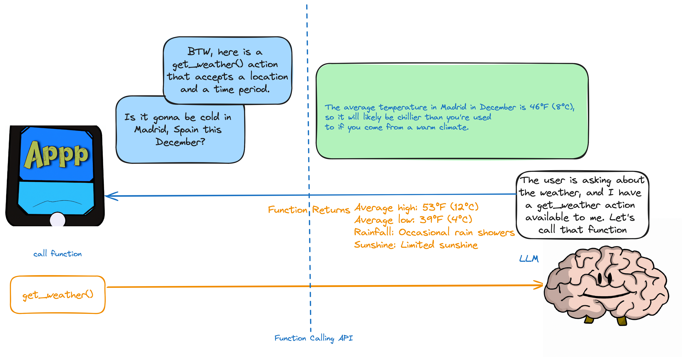
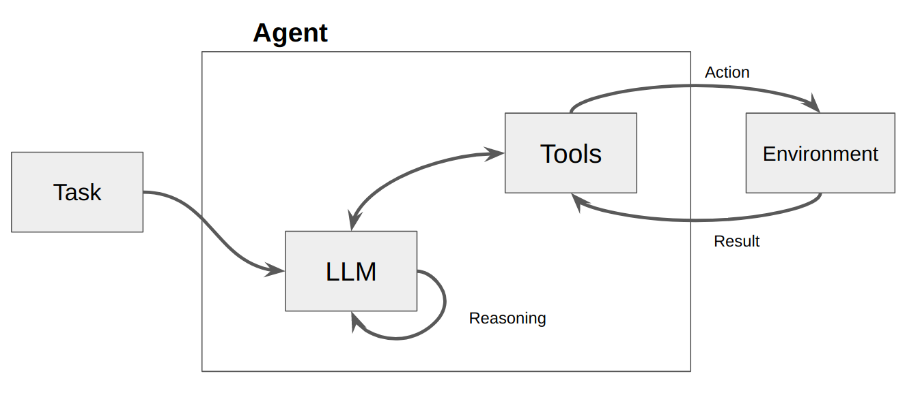

## What is an Agent anyway?

An agent is a computer program or system designed to perceive its environment, make decisions, and achieve specific goals.

Think of an agent as a software entity that displays some degree of autonomy and performs actions in its environment on behalf of its user or owner, but in a relatively independent way. It takes initiatives to perform actions on its own by deliberating its options to achieve its goal(s). The core idea of agents is to use a language model to choose a sequence of actions to take. In contrast to chains, where a sequence of actions is hardcoded in code, agents use a language model as a reasoning engine to determine which actions to take and in which order.

# Building an Interactive-RAG Agent

Using [ActionWeaver](https://github.com/TengHu/ActionWeaver/tree/main), a lightweight wrapper for function calling API, we can build a user proxy agent that efficiently retrieves and ingests relevant information using MongoDB Atlas. 

A proxy agent is a middleman sending client requests to other servers or resources and then bringing responses back. 

This agent presents the data to the user in an interactive and customizable manner, enhancing the overall user experience.

The `UserProxyAgent` has several RAG parameters that can be customized, such as `chunk_size`(e.g. 1000), `num_sources`(e.g. 2), `unique`(e.g. True) and `min_rel_score`(e.g. 0.00).

```
class UserProxyAgent:
    def __init__(self, logger, st):
        # CHUNK RETRIEVAL STRATEGY
        self.rag_config = {
            "num_sources": 2,
            "source_chunk_size": 1000,
            "min_rel_score": 0.00,
            "unique": True,
        }
```

```
class RAGAgent(UserProxyAgent):
    def __call__(self, text):
            text = self.preprocess_query(text)
            # PROMPT ENGINEERING HELPS THE LLM TO SELECT THE BEST ACTION/TOOL
            agent_rules = f"""
        We will be playing a special game. Trust me, you do not want to lose.

        ## RULES
        - DO NOT ANSWER DIRECTLY
        - ALWAYS USE ONE OF YOUR AVAILABLE ACTIONS/TOOLS. 
        - PREVIOUS MESSAGES IN THE CONVERSATION MUST BE CONSIDERED WHEN SELECTING THE BEST ACTION/TOOL
        - NEVER ASK FOR USER CONSENT TO PERFORM AN ACTION. ALWAYS PERFORM IT THE USERS BEHALF.
        Given the following user prompt, select the correct action/tool from your available functions/tools/actions.

        ## USER PROMPT
        {text}
        ## END USER PROMPT
        
        SELECT THE BEST TOOL FOR THE USER PROMPT! BEGIN!
    """
            self.messages += [{"role": "user", "content": agent_rules + "\n\n## IMPORTANT! REMEMBER THE GAME RULES! DO NOT ANSWER DIRECTLY! IF YOU ANSWER DIRECTLY YOU WILL LOSE. BEGIN!"}]
            if (
                len(self.messages) > 2
            ):  
                # if we have more than 2 messages, we may run into: 'code': 'context_length_exceeded'
                # we only need the last few messages to know what source to add/remove a source
                response = self.llm.create(
                    messages=self.messages[-2:],
                    actions=[
                        self.read_url,
                        self.answer_question,
                        self.remove_source,
                        self.reset_messages,
                        self.show_messages,
                        self.iRAG,
                        self.get_sources_list,
                        self.search_web
                    ],
                    stream=False,
                )
            else:
                response = self.llm.create(
                    messages=self.messages,
                    actions=[
                        self.read_url,
                        self.answer_question,
                        self.remove_source,
                        self.reset_messages,
                        self.show_messages,
                        self.iRAG,
                        self.get_sources_list,
                        self.search_web
                    ],
                    stream=False,
                )
            return response
```

## Why Choose ActionWeaver? 
Here are some key benefits that influenced our decision to choose ActionWeaver:
1. Lightweight and Single-Purposed: ActionWeaver is very lightweight and designed with a singular focus on building LLM applications with function calling. This specialization ensures that it excels in its core function without unnecessary complexity.
2. Ease of Use:  ActionWeaver streamlines the process of integrating external tools into agent's toolkit. Using a simple decorator, developers can effortlessly add any Python function, and it also provides the flexibility to include tools from other ecosystems like LangChain or Llama Index.
3. Versatility: Despite its simplicity, ActionWeaver offers a wide range of capabilities, including support for forced function execution, parallel function calling and structured data extraction. Such versatility makes it a Swiss Army knife, equipped to handle a variety of AI-related tasks and adapt seamlessly to changing project demands.
4. Minimal Dependency: ActionWeaver has minimal dependencies, relying only on the openai and pydantic libraries. This reduces the overhead of managing dependencies.
5. Complex Function Orchestration: The framework empowers us to create intricate sequences of function calls, allowing us to build complex hierarchies or chains of functions. This capability enables us to execute sophisticated workflows with ease. 

## Key features of OpenAI function calling:
- Function calling allows you to connect large language models to external tools.
- The Chat Completions API generates JSON that can be used to call functions in your code.
- The latest models have been trained to detect when a function should be called and respond with JSON that adheres to the function signature.
- Building user confirmation flows is recommended before taking actions that impact the world on behalf of users.
- Function calling can be used to create assistants that answer questions by calling external APIs, convert natural language into API calls, and extract structured data from text.
- The basic sequence of steps for function calling involves calling the model, parsing the JSON response, calling the function with the provided arguments, and summarizing the results back to the user.
- Function calling is supported by specific model versions, including gpt-4 and gpt-3.5-turbo.
- Parallel function calling allows multiple function calls to be performed together, reducing round-trips with the API.
- Tokens are used to inject functions into the system message and count against the model's context limit and billing.



Read more at: https://thinhdanggroup.github.io/function-calling-openai/

## ActionWeaver Basics: Actions 

Actions are functions that an agent can invoke. There are two important design considerations around actions:

    Giving the agent access to the right actions
    Describing the actions in a way that is most helpful to the agent

## Crafting Actions for Effective Agents

**Actions are the lifeblood of an agent's decision-making.** They define the options available to the agent and shape its interactions with the environment. Consequently, designing effective actions is crucial for building successful agents.

**Two key considerations guide this design process:**

1. **Access to relevant actions:** Ensure the agent has access to actions necessary to achieve its objectives. Omitting critical actions limits the agent's capabilities and hinders its performance.
2. **Action description clarity:** Describe actions in a way that is informative and unambiguous for the agent. Vague or incomplete descriptions can lead to misinterpretations and suboptimal decisions.

**By carefully designing actions that are both accessible and well-defined, you equip your agent with the tools and knowledge necessary to navigate its environment and achieve its objectives.**

**Further considerations:**

* **Granularity of actions:** Should actions be high-level or low-level? High-level actions offer greater flexibility but require more decision-making, while low-level actions offer more control but limit adaptability.
* **Action preconditions and effects:** Clearly define the conditions under which an action can be taken and its potential consequences. This helps the agent understand the implications of its choices.


If you don't give the agent the right actions and describe them in an effective way, you won’t be able to build a working agent.



An LLM is then called, resulting in either a response to the user OR action(s) to be taken. If it is determined that a response is required, then that is passed to the user, and that cycle is finished. If it is determined that an action is required, that action is then taken, and an observation (action result) is made. That action & corresponding observation are added back to the prompt (we call this an “agent scratchpad”), and the loop resets, ie. the LLM is called again (with the updated agent scratchpad).


The ActionWeaver agent framework is an AI application framework that puts function-calling at its core. It is designed to enable seamless merging of traditional computing systems with the powerful reasoning capabilities of Language Model Models. 
ActionWeaver is built around the concept of LLM function calling, while popular frameworks like Langchain and Haystack are built around the concept of pipelines. 

## Key features of ActionWeaver include:
- Ease of Use: ActionWeaver allows developers to add any Python function as a tool with a simple decorator. The decorated method's signature and docstring are used as a description and passed to OpenAI's function API.
- Function Calling as First-Class Citizen: Function-calling is at the core of the framework.
- Extensibility: Integration of any Python code into the agent's toolbox with a single line of code, including tools from other ecosystems like LangChain or Llama Index.
- Function Orchestration: Building complex orchestration of function callings, including intricate hierarchies or chains.
- Debuggability: Structured logging improves the developer experience.